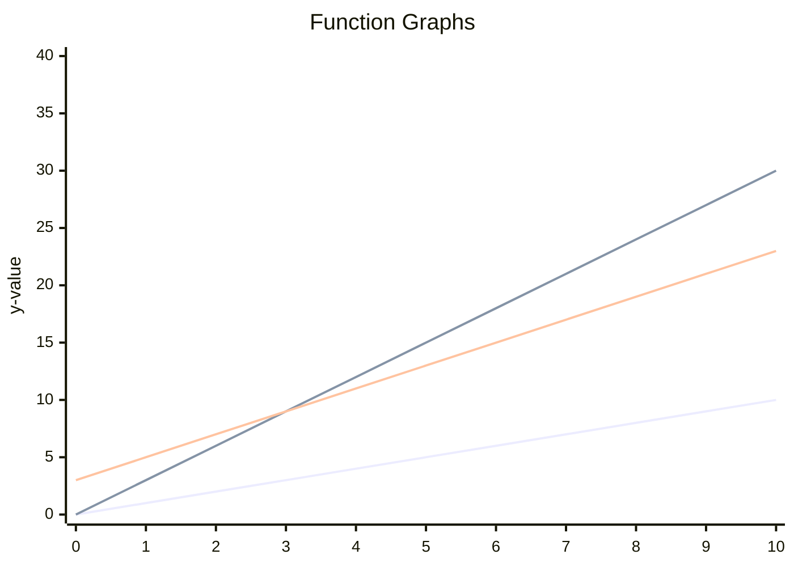

# Complexity

## Purpose

With concept of complexity, we can evaluate a solution.

## How?

### Math Concept

Complexity quantifies the maximum resources required to solve a problem or execute an algorithm, aiding in identifying efficient algorithms for optimal problem-solving by understanding the relationship between resource usage and input size; for example, the total time to create x books may be as follow:

Time(n) = 4n^3 + 4n^2 + 3

However, in real world problems, precise function to describe the total time of producing n amount of books does not exist at all, so we use **asymptotic notations**.

#### Asymptotic Notations

There are commonly used notations in computer science, such as big-O (O), big-theta (Θ), and big-omega (Ω), which are used to describe and analyze the time or space complexity of algorithms. For more detailed definitions and explanations of these notations, I recommend referring to reputable academic sources available online and we only focus on the definition of industry here.

The definition of **O** in industry is the same as the definition of **Θ** in academia; that is

$\Theta(g(n)) = \{ f(n) | \ \exists \ c_0, c_1, n_0 > 0 \ \forall n > n_0, \ s.t. \ 0 \leq c_0g(n) \leq f(n) \leq c_1g(n) \}$

Then f(n) is an element of $\Theta$ of g(n), which is what industry care about ($O$, big-O); for example, $2x + 100$ is an element of $\Theta(x)$; then we can use $x$ to describe the complexity of $2x + 100$. The following plot demonstrates that $2x + 100$ is wrapped by $$3x$$ and $$x$$ after $x > 3$



#### Notation Simplification

Based on the defination, we know that the big O of

* $2x + 100$ is $2x$ and also $x$
* $2x^2 + x$ is $x^2$ because of
  $$ \exists \ a, b > 0 \ s.t \ ax^2 < 2x^2 + x < bx^2 \ \forall x>0$$

That is, all the constant number can be ignored.

* $O(x + a) = O(x)$, where a is constant
* $O(x - a) = O(x)$, where a is constant
* $O(ax) = O(x)$, where a is constant
* $O(x/a) = O(x)$, where a is constant

### Time Complexity

Recap, the definition of big-O (O) in industry is the same as big-theta (Θ) in academia. The meaning of `Time complexity = O(n)` is that the time taken by the algorithm increases proportionally with the size of the input.

#### Amortized Time

In certain data structures, the time complexity of specific operations may vary significantly; for example, an array resizing during element addition takes O(n) time, yet most additions are constant time O(1), leading us to evaluate the average time taken by **a sequence of operations rather than a single operation**.

* Amortized time complexity analysis involves dividing the total time taken by a sequence of operations by the number of operations. This gives us the average time taken per operation, which is a more useful measure of the data structure's performance than the worst-case time complexity of a single operation.
* Accounting method, which involves assigning a cost to each operation and using the cost to pay for future operations. For example, in an array with dynamic resizing, we could assign a cost of 1 to each add operation, and use the extra time taken by the occasional resize operation to pay for the cost of the future operations.
* Example: Array Resizing
  * Suppose we init an array with space of 4 and when we add the fifth element, we need to resize the array, going to have O(n) complexity.
  * After the resizing, we can have another four space for the 5-8 element. That is, the time complexity of this space adding process, O(n) should actually be added to the next 5-8 element adding.
  * If we divide O(n) to the next 4 elements, then the amortized time complexity will be O(1).

### space complexity

The meaning of `Space complexity = O(n)` is that the space taken by the algorithm increases proportionally with the size of the input.

### Conceptual Example

#### Two Liner Iteration

* code
  ```javascript
  for (let i = 0; i < arrayA.length; i++) {
    console.log(arrayA[i])
  }
  for (let i = 0; i < arrayB.length; i++) {
    console.log(arrayB[i])
  }
  ```
* Time complexity = O(A + B)
  * Picks elements from arrayA, each pick = O(1)
  * Picks elements from arrayB, each pick = O(1)
* Space complexity = O(1)
  * Only need a space for i => O(1)

#### Iteration in An Iteration

* code
  ```javascript
  for (let i = 0; i < arrayA.length; i++) {
    for (let j = 0; j < arrayB.length; j++) {
      console.log(arrayA[i] + arrayB[j])
    }
  }
  ```
* Time complexity = O(A * B)
  * A will be query with i and B will be query with j in O(1) each
  * The combination of (i, j) = [0..lengthOfA] x [0..lengthOfB]
* Space complexity = O(2) = O(1)
  * The space required by i and j is constant

#### Recursive Binary Search

* code
  ```javascript
  function binarySearch(array, target) {
    let low = 0;
    let high = array.length - 1;
  
    while (low <= high) {
      let middle = Math.floor((low + high) / 2);
      
      if (array[middle] === target) {
        return true;
      }
      
      if (target < array[middle]) {
        high = middle - 1;
      } else {
        low = middle + 1;
      }
    }
    
    return false;
  }
  ```
* time complexity = O(log N)
  * Given the number of the elements in an array is 16, then it at most need to work through 5 elements to find the target with steps: the middle element of 16 elements (step 1) -> the middle element of 8 elements (step 2) -> the middle element of 4 elements (step 3) -> the middle element of 2 elements (step 4) -> the middle element of 1 element (step 5)
  * We can describe the number of traverse (k) with the number of elements (N) as follow: $$N = 2^k => k = log_2N = logN$$, so the complexity = $$O(logN)$$
* Space complexity = O(log N) for middleIndex
  * Again, given the elements in an array is 16, at most need to work through 5 elements. Because it is recursive, before we find the answer, all the binarySearch will be store in stack and wait the final binarySearch to return answer. Because each binarySearch need one middleIndex, O(1) and it will also be 5 steps, so the space complexity is also O(log N)

#### Recursive, Fibonacci Series

* code
  ```javascript
  function fibonacci(n) {
    if (n < 2) {
      return n;
    }
    else {
      return fibonacci(n - 1) + fibonacci(n - 2);
    }
  }
  ```
* plot
  ```mermaid
  graph TD
    id1((f_4)) --> id2((f_3))
    id1((f_4)) --> id3((f_2))
  
    id2((f_3)) --> id4((f_2))
    id2((f_3)) --> id5((f_1))
  
    id4((f_2)) --> id6((f_1))
    id4((f_2)) --> id7((f_0))
  
    id3((f_2)) --> id8((f_1))
    id3((f_2)) --> id9((f_0))
  ```
* time complexity = $$O(2^N)$$
  * Given every function will request two functions, the time complexity = O(1 + 2 + 4 + ... + 2^(n-1)) = O(2^n - 1) = O(2^n)
* space complexity = $$O(N)$$
  * The data we need to store is f(1), f(2), ... f(n), meaning the space complexity = O(n)

### Product of A and B

* code
  ```javascript
  function product(a, b) {
    let sum = 0
    for (i = 0; i < b; i ++) {
      sum += a
    }
    return sum
  }
  ```
* Time complexity: it will add a for b times, so the time complexity will be O(b)

### b^a

* code
  ```javascript
  function power(a, b) {
    let result = 1
    for (i = 0; i < a; i++) {
      result * b
    } 
  }
  ```
* Time complexity: it will time result a times, so the time complexity is O(a).

### A % B

* code
  ```javascript
  function mod(a, b) {
    let result = a
    while (result >= b) {
      result - b
    }
    return result
  }
  ```
* Time complexity: it will calculate (A/B) times, so the time complexity is O(A/B).

## Reference

cracking the coding interview
