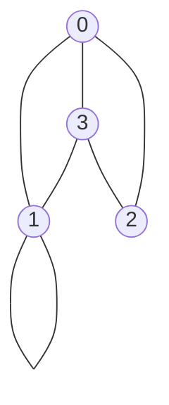
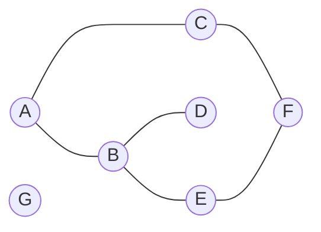

# title

## Purpose

Graphs are valuable tools for visually representing the relationships and connections among data points, enabling us to easily discern patterns and gain insightful observations.

## Concept

### Basic Concept

Let's look at following undirected graph. There are vertices and edges and we are going to research how to use data structure to represent it.



* Vertices: Based on the nodes in the flowchart, the vertices can be represented by the numbers 0, 1, 2, and 3.
* Edges: Based on the connections between the nodes in the flowchart, the edges can be considered as undirected edges connecting the vertices.

#### Representation

There are three ways: adjacency matrices, adjacency lists, edge lists.

* Adjacency matrices of undirected edges
  ```bash
     | 0 | 1 | 2 | 3 |
  ---------------------
  0  | 0 | 1 | 1 | 1 |
  1  | 1 | 1 | 0 | 1 |
  2  | 1 | 0 | 0 | 1 |
  3  | 1 | 1 | 1 | 0 |
  ```
  * The value 1 represents the presence of an edge between two vertices. If the edge is undirected, there will be 1 in both intersected cells.
* Adjacency lists (what I prefer, please refer to [here](https://medium.com/basecs/from-theory-to-practice-representing-graphs-cfd782c5be38))
  ```bash
  0: [1, 3]
  1: [1]
  2: [0]
  3: [1, 2]
  ```
  * Each vertex is associated with a list of vertices it is connected to.
  * For example, vertex 0 is connected to vertices 1 and 3.
* Edge lists
  ```bash
  [(0, 1), (0, 3), (1, 1), (2, 0), (3, 1), (3, 2)]
  ```
  * Each tuple represents an edge between two vertices.
  * For example, there is an edge from vertex 0 to vertex 1, from vertex 0 to vertex 3, and so on.

### Basic Form

Here we are going to use adjacency list to build the class of undirected graph.

* Basic data structure of the graph above
  ```javascript
  const graph = {
    0: [1, 2],
    1: [0, 1, 3],
    2: [0, 3],
    3: [0, 1, 2]
  };
  ```
* Code example
  ```javascript
  class Graph {
    // Adjacency list form
    // Undirected edges
    // No attributes on edges and nodes
    constructor() {
      this.adjacencyList = {};
    }

    // Create
    addVertex(vertex) {
      this.adjacencyList[vertex] = [];
    }
  
    addEdge(vertex1, vertex2) { // push both side because it is undirected
      this.adjacencyList[vertex1].push(vertex2);
      this.adjacencyList[vertex2].push(vertex1);
    }

    // Read
    getNeighbors(vertex) {
      return this.adjacencyList[vertex];
    }

    getVertices() {
      return Object.keys(this.adjacencyList);
    }

    getEdges() { // It will return Set of arrays
      const edges = new Set()
      for (let [vertexOne, vertexTwos] of Object.entries(this.adjacencyList)) {
        vertexTwos.forEach((vertexTwo) => {edges.add([parseInt(vertexOne), vertexTwo])})
      }
      return edges
    }

    findVertex(vertex) {
      return this.vertices.has(vertex)
    }

    findEdge(vertex1, vertex2) {
      return this.vertices.get(vertex1).has(vertex2) && this.vertices.get(vertex2).has(vertex1)
    }

    // Update
    // There will be no update methods for vertex and edge because in this class there is no attributes for both of them.
  
    // Destroy
    removeEdge(vertex1, vertex2) {
      let index2 = this.adjacencyList[vertex1].indexOf(vertex2)
      let index1 = this.adjacencyList[vertex2].indexOf(vertex1)
      if (index2 > -1) {
        this.adjacencyList[vertex1].splice(index2, 1)
      }
      if (index1 > -1) {
        this.adjacencyList[vertex2].splice(index1, 1)
      }
    }

    removeVertex(vertex) {
      while (this.adjacencyList[vertex].length) {
        neighborVertex = this.adjacencyList[vertex].pop();
        this.removeEdge(vertex, neighborVertex)
      }
    }
  }

  module.exports = Graph;
  ```
* spec
  ```javascript
  const Graph = require('../examples/graph.js');

  describe('Graph', () => {
    let testGraph
    beforeEach(() => {
      testGraph = new Graph();
      [1, 2, 3, 4].forEach(node => testGraph.addVertex(node));
      [[1, 2], [1, 4], [2, 4]].forEach(edge => testGraph.addEdge(edge[0], edge[1]))
    })
  
    test('#init', () => {
      expect(testGraph.getNeighbors(1)).toEqual([2, 4]);
      expect(testGraph.getNeighbors(2)).toEqual([1, 4]);
      expect(testGraph.getNeighbors(3)).toEqual([]);
      expect(testGraph.getNeighbors(4)).toEqual([1, 2]);
    })
  
    // create
    test('#addVertex', () => {
      testGraph.add(5)
      expect(testGraph.getVertices()).toEqual([1, 2, 3, 4, 5])
    })
  
    test('#addEdge', () => {
      newEdge = [1, 3]
      testGraph.addEdge(newEdge[0], newEdge[1])
      expect(testGraph.getEdges()).toEqual(new Set([
        [1, 2],
        [1, 4],
        [2, 1],
        [2, 4],
        [4, 1],
        [4, 2],
        [1, 3],
        [3, 1],
      ]));
    })
  
    // read
    test('#getNeighbors', () => {
      expect(testGraph.getNeighbors(1)).toEqual([2, 4])
      expect(testGraph.getNeighbors(2)).toEqual([1, 4])
      expect(testGraph.getNeighbors(3)).toEqual([])
      expect(testGraph.getNeighbors(4)).toEqual([1, 2])
    })
  
    test.only('#getVertices', () => {
      expect(testGraph.getVertices()).toEqual([1, 2, 3, 4])
    })
  
    test('#getEdges', () => {
      expect(testGraph.getEdges()).toEqual(new Set([
        [ 1, 2 ],
        [ 1, 4 ],
        [ 2, 1 ],
        [ 2, 4 ],
        [ 4, 1 ],
        [ 4, 2 ]
      ]));
    })
  
    test('#findVertex', () => {
      expect(testGraph.findVertex(1)).toEqual(true)
      expect(testGraph.findVertex(5)).toEqual(false)
    })
  
    test('#findEdge', () => {
      expect(testGraph.findEdge(1, 2)).toEqual(true)
      expect(testGraph.findEdge(1, 4)).toEqual(true)
      expect(testGraph.findEdge(2, 4)).toEqual(true)
    })
  
    // update
  
    // destroy
    test('removeEdge', () => {
      testGraph.removeEdge(1, 2)
      expect(testGraph.getNeighbors(1)).toEqual([4]);
      expect(testGraph.getNeighbors(2)).toEqual([4]);
    })
  
    test('removeVertex', () => {
      testGraph.removeVertex(1)
      expect(testGraph.getVertices()).toEqual([2, 3, 4]);
      expect(testGraph.getEdges()).toEqual();
    })
  })
  ```
* Time complexity
  * Adding a vertex: O(1) (constant time)
  * Adding an edge: O(1) (constant time)
  * Removing a vertex: O(V + E) (linear time, where V is the number of vertices and E is the number of edges)
  * Removing an edge: O(1) (constant time)
  * Finding a vertex: O(V) (linear time)
  * Finding an edge: O(E) (linear time)

### Traversal Algorithm

I am going to use following graph to build traversal algorithms



#### DFS (depth first search)

##### Purpose

* Find paths between two vertices
* Detect cycles in a graph
* Determine whether a graph is bipartite

##### Concept

1. Choose a starting vertex in the graph.
2. Visit the starting vertex and mark it as visited.
3. Choose an unvisited neighbor of the current vertex.
4. Move to the chosen neighbor and repeat steps 2 and 3 recursively.
5. If there are no unvisited neighbors, backtrack to the previous vertex and choose the next unvisited neighbor (if any).
6. Repeat steps 2-5 until all vertices have been visited or the desired condition is met.

##### Example

* Given the graph above, A -> B -> D -- backtrack to B -> E -> F -> C, so the result will be [A, B, D, E, F, C, G] (Intuition: [video](https://www.youtube.com/watch?v=7fujbpJ0LB4))
* Time complexity: O(V + E)
  * Intuition: You need to add V nodes into set, which is O(V) and you need to loop through all neighbors, which is O(E)
* Code Example
  ```javascript
  class GraphTraversal extends Graph {
    depthFirstSearch(startVertex, visited = new Set()) {
      visited.add(startVertex);
      this.getNeighbors(startVertex).forEach(neighbor => { // O(E)
        if(!visited.has(neighbor)) { // O(V)
          this.depthFirstSearch(neighbor, visited)
        }
      })
      return visited
    }
    ...
  }

  module.exports = GraphTraversal;
  ```
* Spec:
  ```javascript
  const Graph = require('../examples/graph.js');
  
  describe('Graph', () => {
    beforeEach(() => {
      let testGraph = new Graph();
      ['A', 'B', 'C', 'D', 'E', 'F', 'G'].forEach(node => testGraph.addVertex(node));
      [['A', 'B'], ['A', 'C'], ['B', 'D'], ['B', 'E'], ['C', 'F'], ['E', 'F']].forEach(edge => testGraph.addEdge(edge[0], edge[1]))
    })
  
    test('DFS', () => {
      expect(testGraph.depthFirstSearch('A')).toEqual(['A', 'B', 'D', 'E', 'F', 'C', 'G']);
    })
    ...
  })
  ```

#### BFS (breath first search)
  
##### Purpose

* Find the shortest path between two nodes in an unweighted graph
* Find all the nodes that are at a certain distance from a given node
* Check for the existence of a path between two nodes in a graph

##### Solution

1. Choose a starting vertex in the graph.
2. Enqueue the starting vertex into a queue and mark it as visited.
3. While the queue is not empty, perform the following steps:
    * Dequeue a vertex from the front of the queue.
    * Visit the dequeued vertex.
4. For each unvisited neighbor of the visited vertex, do the following:
    * Enqueue the unvisited neighbor into the queue.
    * Mark the neighbor as visited.
5. Repeat steps 3 and 4 until the queue becomes empty.

##### Example

Given the graph above

* The queue and visited
  ```javascript
  {queue: [A], visited: []}
  {queue: [], visited: [A]}
  {queue: [B, C], visited: [A]}
  {queue: [C], visited: [A, B]}
  {queue: [C, D, E], visited: [A, B]}
  {queue: [D, E], visited: [A, B, C]}
  {queue: [D, E, F], visited: [A, B, C]}
  {queue: [E, F], visited: [A, B, C, D]}
  {queue: [F], visited: [A, B, C, D, E]}
  {queue: [F], visited: [A, B, C, D, E, F]}
  ```
* Intuition: [video](https://www.youtube.com/watch?v=oDqjPvD54Ss&t=85s)
* Time complexity: O(V + E)
  * Given the result in example section, we can see that it will enqueue all nodes to visited array once and enqueue all nodes with edges to other nodes and not visited once, making the complexity to be V + E
* code example
  ```javascript
  class GraphTraversal extends Graph {
    breadthFirstSearch(startingVertex) {
      const queue = [startingVertex];
      const visited = new Set([startingVertex]);
  
      while (queue.length) {
        const currentVertex = queue.shift();
        const neighbors = this.getNeighbors(currentVertex);
    
        for (let neighbor of neighbors) {
          if (!visited.has(neighbor)) {
            visited.add(neighbor);
            queue.push(neighbor);
          }
        }
      }
      
      return visited;
    }

    ...
  }

  module.exports = GraphTraversal;
  ```
* spec
  ```javascript
  const Graph = require('../examples/graph.js');
  
  describe('Graph', () => {
    beforeEach(() => {
      let testGraph = new Graph();
      ['A', 'B', 'C', 'D', 'E', 'F', 'G'].forEach(node => testGraph.addVertex(node));
      [['A', 'B'], ['A', 'C'], ['B', 'D'], ['B', 'E'], ['C', 'F'], ['E', 'F']].forEach(edge => testGraph.addEdge(edge[0], edge[1]))
    })
  
    ...
  
    test('BFS', () => {
      expect(testGraph.breadthFirstSearch('A')).toEqual(new Set(['A', 'B', 'C', 'D', 'E', 'F']));
    })
  })
  ```

#### DFS vs BFS

* Memory efficiency: DFS > BFS because DFS do not need another queue to store nodes going to be visited.
* Detecting cycles: DFS > BFS because DFS will go deeper first, which will return to a visited node on a route first, compared to BFS.
* Find shortest path: DFS < BFS because BFS does level-by-level exploration. When we find a target nodes, we can stop the exploration and return the path from a node to target node.

## What?

### Route Between Nodes

* Problem: Given a **directed** graph, design an algorithm to find out whether there is a route between two nodes.
* Example
  * Normal: I think I do not need more information and I will use DFS.
  * Edge: What if there is route between two node but the direction is wrong? If the graph is A -> B -> C, then there is route from A to C but not C to A.
* Time complexity: It at most need to traverse all the nodes, so the time complexity is O(V+E)
* Code
  ```javascript
  function routeBetweenNodes (graph, start, end) {
    if (start === end) {
      return true
    }
    let nextNodes = graph.getNeighbors(start)
    for (let i = 0; i < nextNodes.length; i ++) {
      if (routeBetweenNodes(graph, nextNodes[i], end)) {
        return true
      }
    }
    return false
  }
  
  module.exports = routeBetweenNodes
  ```
* Test
  * Visualize
    ```mermaid
    flowchart LR
        a((A)) ---> b((B))
        a((A)) ---> c((C))
        b((B)) ---> d((D))
        b((B)) ---> e((E))
        c((C)) ---> f((F))
        e((E)) ---> f((F))
        g((G))
    ```
  * Code
    ```javascript
    const DirectedGraph = require('../examples/directed-graph.js')
    const routeBetweenNodes = require('../examples/route-between-nodes.js')
    
    describe('Route Between Nodes', () => {
      let testGraph
      beforeEach(() => {
        testGraph = new DirectedGraph();
        ['A', 'B', 'C', 'D', 'E', 'F', 'G'].forEach((node) => {
          testGraph.addVertex(node);
        });
        [['A', 'B'], ['B', 'D'], ['B', 'E'], ['E', 'F'], ['A', 'C'], ['C', 'F']].forEach(edge => testGraph.addEdge(edge[0], edge[1]))
      })
    
      test('#', () => {
        expect(routeBetweenNodes(testGraph, 'A', 'F')).toEqual(true)
        expect(routeBetweenNodes(testGraph, 'C', 'E')).toEqual(false)
      })
    })
    ```
* Conclusion: Time complexity is O(V + E) because I will only visit those nodes once. GPT told me I should use BFS.

### Build Order

* Question: You are given a list of projects and a list of dependencies (which is a list of pairs of projects, where the second project is dependent on the first project). Ail of a project's dependencies must be built before the project is. Find a build order that will allow the projects to be built. If there is no valid build order, return an error.
* Example
  * Ok, the list of projects is the vertices in a graph and the dependencies is the edges. I need to use BFS because after one project is built the other projects around this project can be build as well.
  * But the problem is how can I find the root if the graph => I think I need to find the node that is less dependent on other project first.
* Code
  ```javascript
  const DirectedGraph = require("../examples/directed-graph")

  function buildOrder(projects, dependencies) {
    let graph = new DirectedGraph()
    projects.forEach((project) => {
      graph.addVertex(project)
    })
    dependencies.forEach((dependency) => {
      graph.addEdge(dependency[0], dependency[1])
    })
  
    const findStarts = (projects, dependencies) => {
      dependent = dependencies.map((d) => {return d[1]})
      result = projects.filter((element) => !dependent.includes(element))
      return result
    }
  
    starts = findStarts(projects, dependencies)
    for(let i = 0; i < starts.length; i++) {
      let start = starts[i]
      const queue = [start]
      const visits = new Set([start])
  
      while(queue.length) { // this is the important step of BFS
        const currentVertex = queue.shift()
        const neighbors = graph.getNeighbors(currentVertex)
  
        for(let neighbor of neighbors) {
          if(!visits.has(neighbor)) {
            queue.push(neighbor)
            visits.add(neighbor)
          }
        }
      }
  
      for(let i = 0; i < starts.length; i++) { // remember to use let...
        visits.add(starts[i])
      }
  
      if(projects.length === visits.size) {
        console.log(visits)
        return [...visits]
      }
    }
  
    return false
  }
  
  module.exports = buildOrder
  ```
* Test
  ```javascript
  const buildOrder = require('../examples/build-order.js')

  describe('build order', () => {
    let projects = ['a', 'b', 'c', 'd', 'e', 'f']
    let dependencies = [['a', 'd'], ['f', 'b'], ['b', 'd'], ['f', 'a'], ['d', 'c']]
  
    test('#', () => {
      expect(buildOrder(projects, dependencies)).toEqual(['f', 'b', 'a', 'd', 'c', 'e'])
    })
  })
  ```

### detect circle

If we meet the visited node, it means there is circle

```js
function detectCircle(start) {
  let visited = new Set()

  return dfs(start)

  function dfs(node) {
    visited.add(node.val)
    for(neighbor of node.neighbors) {
      if(visited.has(neighbor.val)) {
        return false
      }
      dfs(neighbor)
    }
  }
}
```

## Reference

[Graph Data Structure in Javascript](https://www.tutorialspoint.com/Graph-Data-Structure-in-Javascript#:~:text=A%20graph%20is%20a%20pictorial,the%20vertices%20are%20called%20edges.)

[10 Graph Algorithms Visually Explained](https://towardsdatascience.com/10-graph-algorithms-visually-explained-e57faa1336f3)
