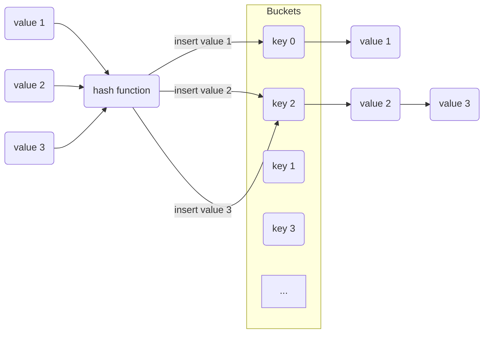

# Title

## Purpose

Hash tables provide fast and efficient storage and retrieval of key-value pairs.

## Concept

For example, we create a hash table where items are linked list.



The value will be calculated by self-defined method in hash function to get the key of buckets and then connects the value with linked list if the mapping key is the same.

Given the length of buckets is N, meaning there are N keys, if we want to search an element, it will first pass the element into hash function to get the key for certain linked list and then search through the linked list.

The time complexity = $$O(A + B)$$, where A is the length of bucket and B is the length of linked list.

* A is actually 1 because the keys are stored in array, so we can access the item in O(1). Please refer to [array]() to see why read an element with given index is O(1).
* B is usually close to 1 if we making the collisions, meaning values map to same key, as low as possible. As a result, the time complexity is actually O(1).

### two sum

* Question
  ```bash
  Input: nums = [2, 7, 11, 15], target = 9
  Output: [0, 1]
  Explanation: nums[0] + nums[1] equals 9, so the indices are 0 and 1.
  
  Input: nums = [3, 2, 4], target = 6
  Output: [1, 2]
  
  Input: nums = [3, 3], target = 6
  Output: [0, 1]
  ```
* Code
  ```javascript
  function twoSum (array, target) {
    const hash = {}
    for (i = 0; i < array.length; i++) {
      if (hash[array[i]] !== undefined) {
        return [hash[array[i]], i]
      } else {
        hash[target - array[i]] = i
      }
    }
    return 'no'
  }

  module.exports = twoSum
  ```
* Test
  ```javascript
  twoSum = require('../examples/two_sum.js')

  describe('Tow Sum', () => {
    test('[2, 7, 11, 15], target = 9', () => {
      expect(twoSum([2, 7, 11, 15], 9)).toEqual([0, 1])
    })
  
    test('[3, 2, 4], target = 6', () => {
      expect(twoSum([3, 2, 4], 6)).toEqual([1, 2])
    })
  
    test('[3, 3], target = 6', () => {
      expect(twoSum([3, 3], 6)).toEqual([0, 1])
    })
  })
  ```

## Example

Real world example: counting the words of an article

```javascript
class WordCounter {
  constructor() {
    this.wordCountMap = new Map();
  }

  countWords(article) {
    const words = article.trim().split(/\s+/);
    for (const word of words) {
      const normalizedWord = word.toLowerCase();
      const count = this.wordCountMap.get(normalizedWord) || 0;
      this.wordCountMap.set(normalizedWord, count + 1);
    }
  }

  getWordCount(word) {
    const normalizedWord = word.toLowerCase();
    return this.wordCountMap.get(normalizedWord) || 0;
  }

  getTopWords(limit) {
    const sortedEntries = Array.from(this.wordCountMap.entries()).sort((a, b) => b[1] - a[1]);
    return sortedEntries.slice(0, limit).map(([word, count]) => ({ word, count }));
  }
}
```

## Reference

GPT
