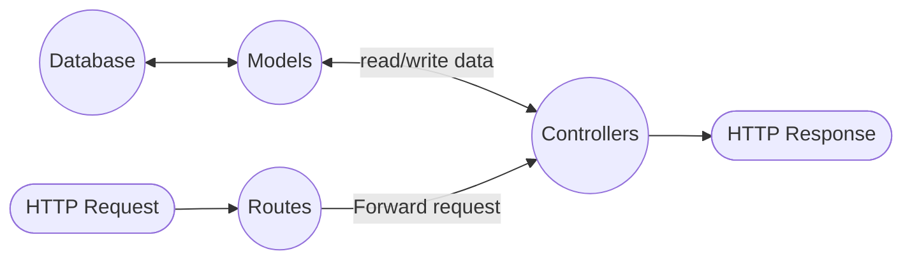

# Title

## Init

* Create project

  ```bash
  mkdir project-name
  cd project-name
  ```

* Install dependencies

  ```bash
  yarn add express
  yarn add dotenv
  ```

* git
  * Init: `git init`
  * `touch .gitignore` with
  
    ```bash
    # Dependency directories
    node_modules/
    
    # dotenv environment variables file
    *.env
    ```

* env: In `./.env`, we can add environment variables we want; for example, how to connect development database ...etc

  ```javascript
  process.env.xxx
  ```

* ES6: In `package.json`

  ```JSON
  {
    "type": "module",
    ...
  }
  ```

* Typescript
  * Install required packages

    ```bash
    yarn add --dev typescript
    yarn add --dev tsc-alias
    yarn tsc --init
    ```

  * Update script

    ```JSON
    "scripts": {
      "dev": "NODE_ENV=dev yarn start",
      "start": "yarn compile && node dist/server.js --experimental-modules",
      "compile": "tsc && tsc-alias",
    }
    ```
  
  * tsconfig

    ```JSON
    {
      "compilerOptions": {
        "allowJs": true,
        "target": "esnext",
        "lib": ["esnext"],
        "module": "esnext",
        "moduleResolution": "node",
        "outDir": "./dist",
        "esModuleInterop": true,
        "forceConsistentCasingInFileNames": true,
        "strict": true,
        "skipLibCheck": true
      },
      "include": [
        "src",
        "tests/**/*.ts",
      ],
      "exclude": [
        "node_modules",
        "dist",
      ],
      "tsc-alias": {
        "resolveFullPaths": true,
        "verbose": true
      }
    }
    ```

  * run app through `yarn run dev`

* eslint
  * install
    ```bash
    yarn add --dev eslint @eslint/js @types/eslint__js typescript typescript-eslint
    ```
  * `eslint.config.js`
    ```js
    // @ts-check
  
    import eslint from '@eslint/js';
    import tseslint from 'typescript-eslint';
  
    export default tseslint.config(
      eslint.configs.recommended,
      ...tseslint.configs.strict,
      ...tseslint.configs.stylistic,
      {
        ignores: [
          '**/coverage/**',
          '**/dist/**',
          '**/migrations/**',
          '**/*.config.js',
          '**/*.config.ts'
        ],
      }
    );
    ```
  * `package.json`
    ```JSON
    "eslint": "eslint",
    "eslint:fix": "eslint --fix",
    ```
* prettier
  * install
    ```
    ```
  * In eslint.config.js
    ```JS
    import eslint from '@eslint/js';
    import tseslint from 'typescript-eslint';
    import prettierPlugin from "eslint-plugin-prettier";

    export default tseslint.config(
      eslint.configs.recommended,
      ...tseslint.configs.strict,
      ...tseslint.configs.stylistic,
      {
        ignores: [
          '**/coverage/**',
          '**/dist/**',
          '**/migrations/**',
          '**/*.config.js',
          '**/*.config.ts'
        ],
      },
      {
        plugins: {
          prettier: prettierPlugin,
        },
        rules: {
          "prettier/prettier": "error",
        },
      },
    );
    ```
* `touch server.ts` with

  ```javascript
  // init
  import express from 'express'
  const app = express();

  if (process.env.NODE_ENV === 'dev') {
    app.listen(5000, () => {
      console.log('start dev')
    })
  } else if (process.env.NODE_ENV === 'test') {
    app.listen(8080, () => {
      console.log('start test')
    })
  } else {
    // TODO for production
  }

  export default app
  ```

* test it with curl: `curl http://localhost:5000/`

* Sequelize for Model and Database
  * Install
    ```bash
    yarn add sequelize
    ```
  * babel
    ```bash
    yarn add babel-register
    ```
  * add `.sequelizerc` in root
    ```JS
    require("babel-register");

    const path = require('path');

    module.exports = {
      config: path.resolve('src/config', 'sequelize.config.js'),
      'models-path': path.resolve('src', 'models'),
      'seeders-path': path.resolve('src', 'seeders'),
      'migrations-path': path.resolve('src', 'migrations'),
    };
    ```
  * `src/config/sequelize.config.js`
    ```JS
    import dotenv from 'dotenv';
    import path from 'path';

    dotenv.config({ path: path.resolve(process.cwd(), `env/${process.env.NODE_ENV}.env`)});

    let config;

    if(process.env.NODE_ENV === 'prod') {
      config = {
        username: process.env.DB_USER,
        password: process.env.DB_PASS,
        database: process.env.DB_NAME,
        host: process.env.DB_HOST,
        dialect: 'postgres',
        port: process.env.DB_PORT,
        dialectOptions: {
          ssl: {
              require: true,
              rejectUnauthorized: false,
            }
          }
      };
    } else {
      config = {
        username: process.env.DB_USER,
        password: process.env.DB_PASS,
        database: process.env.DB_NAME,
        host: process.env.DB_HOST,
        dialect: 'postgres',
        port: process.env.DB_PORT,
      };
    }

    export default config;
    ```
  * Build index model
    ```JS
    import { Sequelize } from "sequelize";
    import path from "path";
    import dotenv from "dotenv";
    import logger from "../logger";
    
    const initializeDatabase = (environment: string): Sequelize => {
      let sequelize;
    
      dotenv.config({
        path: path.resolve(process.cwd(), `env/${environment}.env`),
      });
    
      if (
        !process.env.DB_USER ||
        !process.env.DB_NAME ||
        !process.env.DB_PASS ||
        !process.env.DB_HOST ||
        !process.env.DB_PORT
      ) {
        throw new Error("Database configuration variables are missing");
      }
    
      if (environment === "prod") {
        sequelize = new Sequelize(
          process.env.DB_NAME,
          process.env.DB_USER,
          process.env.DB_PASS,
          {
            logging: console.log,
            host: process.env.DB_HOST,
            port: parseInt(process.env.DB_PORT),
            dialect: "postgres",
            dialectOptions: {
              ssl: {
                require: true,
                rejectUnauthorized: false,
              },
            },
          },
        );
      } else {
        sequelize = new Sequelize(
          process.env.DB_NAME,
          process.env.DB_USER,
          process.env.DB_PASS,
          {
            logging: console.log,
            host: process.env.DB_HOST,
            port: parseInt(process.env.DB_PORT),
            dialect: "postgres",
          },
        );
      }
    
      return sequelize;
    };
    
    const sequelize = initializeDatabase(process.env.NODE_ENV || "dev");
    
    export { initializeDatabase };
    export default sequelize;
    ```
  * Test connection
    ```JS
    import sequelize from "./models/index";

    sequelize
    .authenticate()
    .then(() => {
      logger.info("Connection has been established successfully.");
  
      app.listen(port, () => {
        logger.info(`HTTP server is running on port ${port}`);
      });
    })
    .catch((err: Error) => {
      logger.error("Unable to connect to the database:", err);
    });
    ```
  * create migration file
    ```bash
    npx sequelize-cli migration:generate --name create-tasks
    ```
  * Define the structure in the generated migration file
    ```JS
    module.exports = {
      up: async (queryInterface, Sequelize) => {
        await queryInterface.createTable('Tasks', {
          id: {
            allowNull: false,
            autoIncrement: true,
            primaryKey: true,
            type: Sequelize.INTEGER
          },
          name: {
            type: Sequelize.STRING,
            allowNull: false
          },
          createdAt: {
            allowNull: false,
            type: Sequelize.DATE
          },
          updatedAt: {
            allowNull: false,
            type: Sequelize.DATE
          }
        });
      },
      down: async (queryInterface, Sequelize) => {
        await queryInterface.dropTable('Tasks');
      }
    };
    ```
  * Connect Database
    ```JS
    // models/index.ts
    const Sequelize = require('sequelize');
    const sequelize = new Sequelize('database', 'username', 'password', {
      host: 'localhost',
      dialect: 'postgres' // choose the correct dialect
    });
    // models/task.ts
    const Task = sequelize.define('Task', {
      title: {
        type: Sequelize.STRING,
        allowNull: false
      }
    });
    // Use it with sync in controller; however, not recommended and should use migration files
    Task.sync({force: true}).then(() => {
    console.log('Task table has been successfully created, if one doesn't exist');
    }).catch(error => console.log('This error occurred', error));
    ```
  * Do migrate
    ```bash
    npx sequelize-cli db:migrate
    ```
    * Or in docker
      ```bash
      # Dockerfile
      ENTRYPOINT ["/wait-for-it.sh", "db-dev:5432", "--", "./start_dev.sh"]
      ```
      with
      ```
      #!/bin/bash

      yarn db:migrate:dev
      yarn dev
      ```
* Routes & Controller

  ```JS
  // app.ts
  app.use('/tasks', taskRouter);
  
  // routers/task-router.ts
  router.get('/', asyncHandler(getTasks));
  
  // controllers/task-controller.ts
  const getTasks = async (req: Request, res: Response, next: NextFunction) => {
  }
  ```

## Dockerize

* Dockerfile
  
  ```docker
  # Use an official Node runtime as the base image
  FROM node

  # Set the working directory in the container to /app
  WORKDIR /app
  
  # Copy package.json and package-lock.json into the directory
  COPY package*.json ./
  
  # Install any needed packages specified in package.json
  RUN yarn install
  
  # Bundle app source inside Docker image
  # should copy file by file to avoid security issues
  COPY . .
  
  # Run the app when the container launches
  CMD ["yarn", "dev"]
  ```

* compose file (docker-compose.yml)

  ```yml
  services:
    app-dev:
      build: .
      volumes:
        - .:/app
      ports:
        - "5000:5000"
    db-dev:
      image: timescale/timescaledb:latest-pg16
      restart: unless-stopped
      env_file:
        - ./env/dev.env
      ports:
        - 5432:5432
  ```

* `env.dev`

  ```bash
  # PG credentials
  POSTGRES_PASSWORD=your_db_password
  ```

* Run docker

  ```bash
  docker-compose up
  ```

## Test

I prefer jest.

* Install
  ```bash
  yarn add --dev jest @types/jest
  ```
* Setup script, in `package.json`
  ```JSON
  "scripts": {
    "test": "NODE_ENV=test jest",
    "test:coverage": "NODE_ENV=test jest --coverage",
    "db:migrate:test": "NODE_ENV=test yarn db:migrate",
  },
  ```
* `jest.config.js`
  ```JS
  // Or directly use inline config
  const config = {
    preset: 'ts-jest',
    detectOpenHandles: true,
    testEnvironment: 'node',
    coverageThreshold: {
      global: {
        branches: 70,
        functions: 80,
        lines: 80,
        statements: 80
      }
    },
    setupFilesAfterEnv: ['./tests/setup.ts'],
  };

  export default config;
  ```
* You need to add at least one test to have coverage report.
  ```JS
  // tests/integration/helloWorld.test.ts
  import request from "supertest";
  import app from "../../src/app";
  
  describe("GET /", () => {
    it("responds with Hello, World!", async () => {
      const response = await request(app).get("/");
      expect(response.statusCode).toBe(200);
      expect(response.text).toBe("Hello, World!");
    });
  });
  ```
* Refer to [Docker] for setting up test database; for example, PG
  ```bash
  docker run -d -p 5432:5432 -e POSTGRES_USER=test_user -e POSTGRES_PASSWORD=test_password -e POSTGRES_DB=test_db timescale/timescaledb:latest-pg16
  ```
* migrate test database
  ```bash
  yarn db:migrate:test
  ```
* Use `request(app)` to test the api
  ```javascript
  const request = require('supertest');
  const app = require('../app'); // Import your app
  
  describe('Test the /api path', () => {
    test('It should response the GET method', async () => {
      const response = await request(app).get('/api');
      expect(response.statusCode).toBe(200);
    });
  });
  ```
* Reset database before each case to drop and create tables
  ```javascript
  beforeEach(async () => {
    sequelize.truncate({ cascade: true, restartIdentity: true });
  });
  ```
* Mock: In `spec_config`
  ```javascript
  jest.mock('pg', () => { // should extract to other file
    const mPool = {
      connect: function () {
        return { query: jest.fn() };
      },
      query: jest.fn(),
      end: jest.fn(),
      on: jest.fn(),
    };
    return { Pool: jest.fn(() => mPool) };
  });
  ```
* Run test
  ```bash
  yarn test:coverage
  ```

## App Structure

The structure I prefer

* node app
  * test
  * routes
  * controllers
  * configs
  * models
  * database
    * migrations
  * middleware
  * service in monolith
  * server.js (core file to start the app)



### Naming Convention

* File: use hyphens; for example, `user-controller.js`
* Url: use hyphens; for example, `/node-graph`

### RESTful

```javascript
// restful API
// GET /records -> records#index
// POST /records -> records#create
// GET /records/new -> records#new
// GET /records/:id/edit -> records#edit
// GET /records/:id -> records#show
// PATCH /records/:id -> records#update
// PUT /records/:id -> records#update
// DELETE /records/:id -> records#destroy
```

### Service in monolithic

In a monolithic architecture, a service can refer to a module or a set of related functionality within the application. These services are not independent applications; they are part of the same application and run in the same process. However, they are often organized in a way that separates concerns and makes the application easier to understand and manage.

You can think of the service layer as an intermediary between the controller and model layers in an application. When you find your controllers are too fat and want to extract the code.

Suppose you have two model, product, order. To create a order, you need to check whether there is enough stock in these products. Now, here is the key issue. Think about whether this **checking** is a flow. If the checking may have different route, then it is a flow, then you should not put this logic in model; as this may impose to all the orders. However, as controller mainly deal with http request, we should not put the flow in controller, causing fat controller. As a result, we create services to deal with this kind of flow.

The service:

```javascript
// OrderService.js
class OrderService {
  constructor(productModel, orderModel) {
    this.productModel = productModel;
    this.orderModel = orderModel;
  }

  async createOrder(orderData) {
    const product = await this.productModel.findById(orderData.productId);

    if (product.stock >= orderData.quantity) {
      const order = await this.orderModel.create(orderData);

      product.stock -= orderData.quantity;
      await product.save();

      return order;
    } else {
      // Not enough stock, create a future order
      const futureOrder = await this.orderModel.create({
        ...orderData,
        isFutureOrder: true
      });

      return futureOrder;
    }
  }
}

module.exports = OrderService;
```

The controller:

```javascript
// OrderController.js
const OrderService = require('./OrderService');
const ProductModel = require('./models/Product');
const OrderModel = require('./models/Order');

const orderService = new OrderService(ProductModel, OrderModel);

class OrderController {
  async createOrder(req, res) {
    try {
      const order = await orderService.createOrder(req.body);
      res.status(201).json(order);
    } catch (error) {
      res.status(500).json({ error: error.toString() });
    }
  }
}

module.exports = OrderController;
```

### micro-services

### debugger

In `package.json`,

```JSON
"scripts": {
  "dev": "NODE_ENV=development npx nodemon --inspect server.js",
}
```

In vscode, click `Run and Debug` in the sidebar

In the top, click `Run Script: dev`

Then we can debug the code in [debug console]

## Reference

[How to organize routes in Nodejs Express app](https://stackoverflow.com/questions/59681974/how-to-organize-routes-in-nodejs-express-app)

[How to use .env file in node.js](https://dev.to/dallington256/how-to-use-env-file-in-nodejs-578h)

[Model Querying - Finders](https://sequelize.org/docs/v6/core-concepts/model-querying-finders/)

[jest debug](https://jestjs.io/docs/troubleshooting)

[Mocking a Database in Node with Jest](https://www.youtube.com/watch?v=IDjF6-s1hGk)

[Node.js v19.5.0 documentation](https://nodejs.org/api/http.html)

[npm Passport 筆記（Learn to Use Passport JS）](https://pjchender.dev/npm/npm-passport/)

[Password hashing in Node.js with bcrypt](https://blog.logrocket.com/password-hashing-node-js-bcrypt/)

[](https://developer.mozilla.org/en-US/docs/Learn/Server-side/Express_Nodejs/routes)
