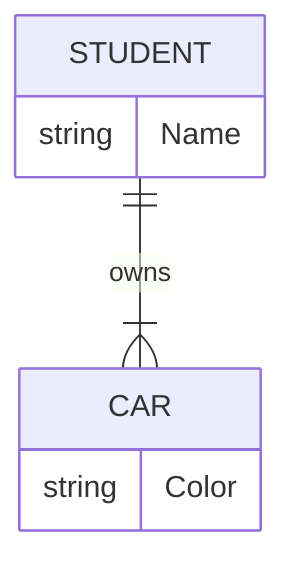
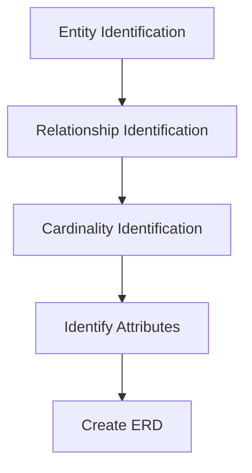

# Title

## Purpose

It helps to build database as correct and quick as possible and fit the demand of user, apps, business.

1.  It provides a preview of how all your tables should connect and what filed are going to be on each table.
2.  It helps to describe entities, attributes, relationships

## Concept

To help explaining the logics of database. Three basic concepts: entities, attributes, relationships.

#### **Real World Example:**



* Entity: Anything in real world
  * Weak entity: Anything existing because an entity exists; for example, a car belongs to CEO in a company. If the CEO leaves a company, then this CEO car should also be eliminate from database.
* Relation: define the relationship between entities
  * For example, a student owns a car
* Attribute: the characteristic of entity
* Cardinality: define the type of relationship: One-to-One, One-to-Many, May to One, Many-to-Many

## Example

There are five steps:



In a market, there are a lot of people, both buyers and sellers, sellers has a lots of goods and buyers use money to buy them. Of course, the buyer can also sell what they bought. Then, the design should be as follow:

* Step1: Define Entities: we should have three entities: sellers, buyers, goods
  ```mermaid
  erDiagram
      SELLER {
          string Name
      }
      
      GOODS {
          string ItemName
      }
  
      BUYER {
          string Name
      }
  ```
* Step2: Define Relationship: Sellers have some goods and buyers want to buy somethings.
  ```mermaid
    erDiagram
      SELLER {
          string Name
      }
    
      GOODS {
          string ItemName
      }

      BUYER {
          string Name
      }

      SELLER ||--o{ GOODS : sells
      GOODS ||--o{ BUYER : bought_by
  ```
* Step3: Cardinality: This market stipulates each seller can only sell a goods and buyers can buy many goods.
  ```mermaid
    erDiagram
      SELLER {
          string Name
      }
    
      GOODS {
          string ItemName
      }

      BUYER {
          string Name
      }

      SELLER ||--|| GOODS : sells
      GOODS ||--o{ BUYER : bought_by
  ```
* Step4: Identify Atrributes
  ```mermaid
  erDiagram
      SELLER {
          string Name
          int SellerID
          string ContactInfo
      }
    
      GOODS {
          string ItemName
          int GoodsID
          float Price
          int Quantity
      }

      BUYER {
          string Name
          int BuyerID
          string Email
      }

      SELLER ||--|| GOODS : sells
      GOODS ||--o{ BUYER : bought_by
  ```

### Reference

[**DBMS Tutorial: Database Management System Notes**  
_Database Management System (DBMS) is a collection of programs which enables its users to access a database, manipulate…_www.guru99.com](https://www.guru99.com/dbms-tutorial.html "https://www.guru99.com/dbms-tutorial.html")[](https://www.guru99.com/dbms-tutorial.html)