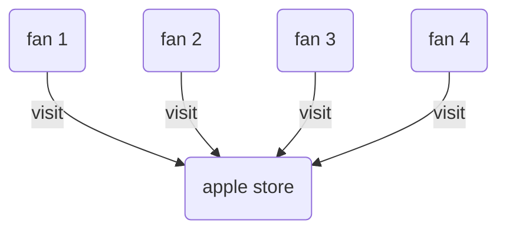
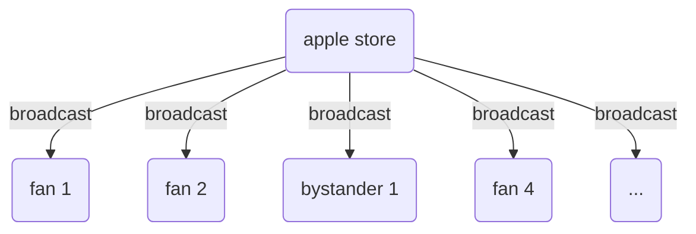
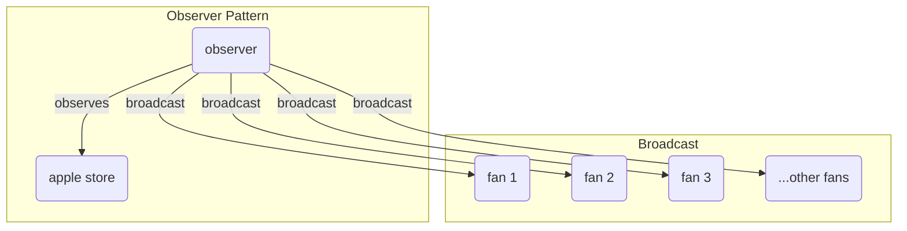
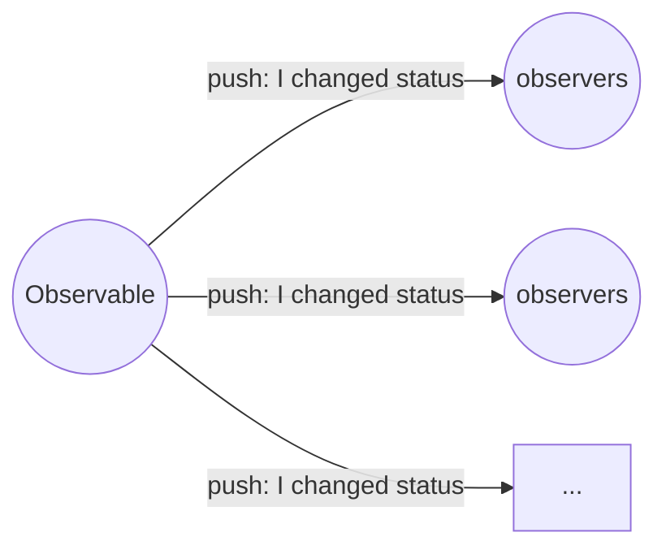
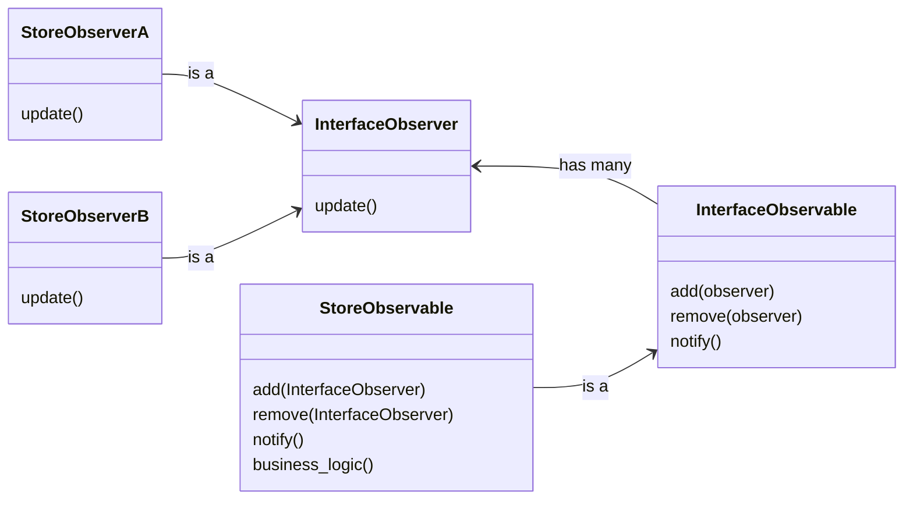

# Title

## Purpose

The purpose of using the observer pattern is to establish a one-to-many dependency between objects, ensuring that when one object changes its state, all its dependents are automatically notified and updated.

## Concept

Apple fans really want new iphone, so they keep visiting store everyday to check whether new iphone released. The company feels disturbed, so they decided to send the release information through advertisements and broadcasts. But in this time, people not interested complain that they do not want to see this information.



Bad solution: (broadcast randomly), which will notify someone not interested or skip some fans



To solve this problem, Apple lets people visiting store for new iphone information to leave email so that the company can send notifications to these people when new iphone released. The notification is just like observer pattern.

Better solution:



1. One to many relationship (one observable (apple store) to many observers (fans))
2. The state of observable changed and all observers are notified



and the UML (suppose fans can receive release information through phone and computer)



* `update`: How observer reacts to observable events
* `add`: Let observers to observe
* `remove`: disable observers to observe
* `notify`: how observable object want observers to react
* `business_logic`: the business logic of observable and observers can react accordingly

### Pros and Cons

* pros
  * Open/Closed Principle. You can introduce new observers classes without having to change the observable’s code (and vice versa).
* cons
  * Subscribers are notified in random order.

## Example

```javascript
class InterfaceObservable {
  add(observer) {
    throw new Error(`${this.constructor.name} has not implemented method 'add'`);
  }

  remove(observer) {
    throw new Error(`${this.constructor.name} has not implemented method 'remove'`);
  }

  notify() {
    throw new Error(`${this.constructor.name} has not implemented method 'notify'`);
  }
}

class InterfaceObserver {
  update(_subject) {
    throw new Error(`${this.constructor.name} has not implemented method 'update'`);
  }
}

class StoreObservable extends InterfaceObservable {
  constructor() {
    super();
    this.state = null;
    this.observers = [];
  }

  add(observer) {
    this.observers.push(observer);
  }

  remove(observer) {
    const index = this.observers.indexOf(observer);
    if (index !== -1) {
      this.observers.splice(index, 1);
    }
  }

  notify() {
    this.observers.forEach(observer => observer.update(this));
  }

  businessLogic() {
    this.state = ['new iphone released', 'no new iphone released'][Math.floor(Math.random() * 2)]; // simulate the business logic going to change the state of the observable
    console.log(`Subject: My state has just changed to: ${this.state}`);
    this.notify();
  }
}

class StoreObserverA extends InterfaceObserver {
  update(subject) {
    console.log(`Inform A: ${subject.state}`);
  }
}

class StoreObserverB extends InterfaceObserver {
  update(subject) {
    console.log(`Inform B: ${subject.state}`);
  }
}

// the implementation
const storeObservable = new StoreObservable();
const storeObserverA = new StoreObserverA();
const storeObserverB = new StoreObserverB();

// let observer observe the observable
storeObservable.add(storeObserverA);
storeObservable.add(storeObserverB);

// the states of the observers will change according to the state of store observable
storeObservable.businessLogic();
storeObservable.businessLogic();

storeObservable.remove(storeObserverA);

// observer A will not be notified
storeObservable.businessLogic();
```

What we can do more:

* add methods to specify informing methods in `StoreObserver`; for example, use phone for `StoreObserverA` and use computer for `StoreObserverB`
* add methods to specify when to inform `StoreObserver`; for example, only particular events or particular timing

## Reference

[Observer Pattern – Design Patterns (ep 2)](https://www.youtube.com/watch?v=_BpmfnqjgzQ&list=PLrhzvIcii6GNjpARdnO4ueTUAVR9eMBpc&index=2)

[Observer in Ruby](https://refactoring.guru/design-patterns/observer/ruby/example)

[Observer](https://refactoring.guru/design-patterns/observer)
