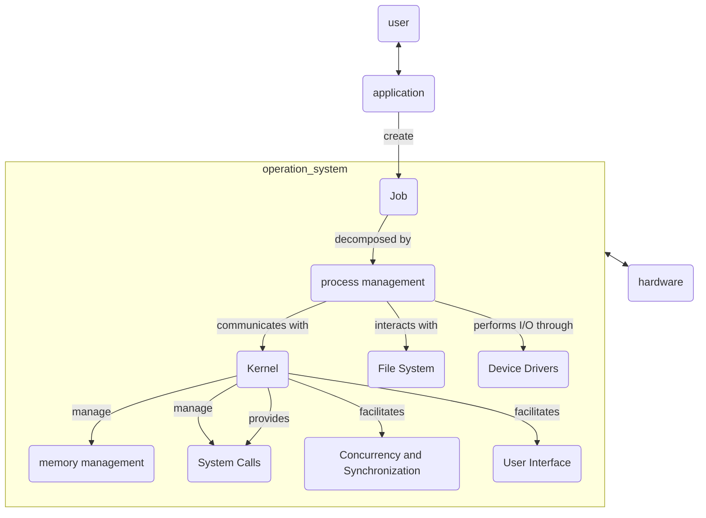

# Title

## Purpose

Understanding low-level computer operations is essential for computer engineering, software development, and information technology professionals to develop efficient software applications, manage computer systems, and enhance security against external threats.

## Concept

### Overview

Operating System serves as the communicator between computer hardware and computer software applications.

When a job or task is initiated from an application, the operating system's process management component handles the creation of a new process, allocating necessary resources through the kernel, managing memory and CPU usage, coordinating I/O operations through device drivers, and providing an interface for user interaction, all while ensuring the overall stability and efficiency of the system.

### Process Management

It involves the creation, scheduling, and termination of processes. It also includes inter-process communication and synchronization. Refer to [process management](/blog/software/os/process-management).

### memory management

It involves keeping track of each byte in a system's memory and which processes are using which memory. It decides which processes to load when memory space becomes available.

### device management

It involves managing all the device controllers to monitor every device, channel, and control unit. It's responsible for the communication between devices.

### file management

It involves the creation, deletion, and access of files. It also provides mechanisms for creating directories and managing disk space.

### security Management

It involves protecting the system's resources and data from unauthorized access and providing a secure way for users to access the system.

### Network Management

This involves managing network connections and network security.

### User Interface Management

This involves managing how users interact with the system, either through a graphical user interface (GUI) or a command-line interface (CLI).

## Example

In this section, let's take a look at the above functions in operating systems and explore them with following steps:

1. user click an app on the computer UI
2. the app start to run and it need some computation
3. the data flow to operation system
4. operation system call hardware (CPU, RAM, I/O) to compute it
5. data sent back to OS
6. OS send data back to app
7. user get what they want in UI

### TODO

mac OS

## Reference

ChatGPT
