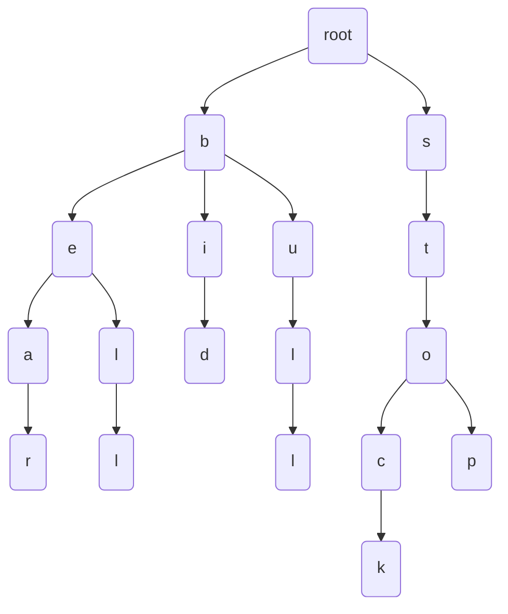

# Title

## Purpose

Tries are a useful data structure for efficiently storing and searching for strings in a large dataset.

## Concept

Suppose we have a set of strings {bear, bell, bid, bull, stock, stop}. We can build a trie for this set of strings as follows:



* code
  ```javascript
  class TrieNode {
    constructor() {
      this.children = {};
      this.isEndOfWord = false;
    }
  }
  
  class Trie {
    constructor() {
      this.root = new TrieNode();
    }
  
    // create
    insert(word) {
      let node = this.root;
      for (let i = 0; i < word.length; i++) {
        const char = word[i];
        if (!node.children[char]) {
          node.children[char] = new TrieNode();
        }
        node = node.children[char];
      }
      node.isEndOfWord = true;
    }
    
    // read
    search(word) {
      let node = this.root;
      for (let i = 0; i < word.length; i++) {
        const char = word[i];
        if (!node.children[char]) {
          return false;
        }
        node = node.children[char];
      }
      return node.isEndOfWord;
    }
  
    // update
    // It is not normal to have update method in tries

    // destroy
    delete(word) {
      let node = this.root
      let nodes = []
      for (let i = 0; i < word.length; i++) {
        const char = word[i]
        if (!node.children[char]) {
          return
        }
        node = node.children[char]
        nodes.push(node)
      }
      if(!node.isEndOfWord) {
        return
      }
      for (let i = nodes.length - 2; i >= 0; i--) {
        if (Object.keys(nodes[i].children).length > 1) {
          continue
        } else {
          delete nodes[i].children[word[i + 1]] // remove the specific children of that character
        }
      }
      node.isEndOfWord = false;
    }
  }
  
  module.exports = Trie
  ```
  * Tries are not design for frequent updates
* Spec
  ```javascript
  const Trie = require('../examples/trie.js')

  describe('Trie', () => {
    let trie = new Trie()
    beforeEach(() => {
      trie.insert('bear')
      trie.insert('bell')
    })
  
    it('should insert words', () => {
      expect(trie.search('bear')).toEqual(true)
      expect(trie.search('bell')).toEqual(true)
    })
  
    it('should delete a word', () => {
      trie.delete('bell')
      expect(trie.search('bell')).toEqual(false)
      expect(trie.search('bear')).toEqual(true)
    })
  })
  ```
* Time complexity (Because tries are usually used for wording, I will discuss the time complexity of CRUD of a wording)
  * Create: Given a tries, to create a word in tries, we need to traverse all the letters in the given word and because all the children of a node lay in a hash, the time complexity to check whether it exists in children is O(1). Then the time complexity will be O(n); that is, traverse all the letters and insert it into the tries.
  * Read: Again, to read a wording in tries, we need to traverse all the letter in the given tries and it is O(n).
  * Delete: It will check whether this word exists in tries and then remove the nodes with only one specific children of corresponding letters. Because the reading of hash is O(1), the time complexity of removing a node is O(n). (Or you can say it is O(n + n) since we need to traverse the tries first)
  * Update: You can think update = delete and then create, so the time complexity is also O(n).

## Real World Example

Real world example: Trie for melody

```javascript
class MelodyTrie {
  constructor() {
    this.root = {};
  }

  insert(melody) {
    let node = this.root;
    for (let i = 0; i < melody.length; i++) {
      const note = melody[i];
      node[note] = node[note] || {};
      node = node[note];
    }
    node.isEnd = true;
  }

  search(melody) {
    let node = this.root;
    for (let i = 0; i < melody.length; i++) {
      const note = melody[i];
      if (!node[note]) {
        return false;
      }
      node = node[note];
    }
    return !!node.isEnd;
  }
}

const melodyTrie = new MelodyTrie();

melodyTrie.insert(['C4', 'D4', 'E4']);
melodyTrie.insert(['E4', 'F4', 'G4', 'A4']);
melodyTrie.insert(['G4', 'F4', 'E4', 'D4']);
melodyTrie.insert(['C4', 'C4', 'C4', 'C4']);

console.log(melodyTrie.search(['C4', 'D4', 'E4'])); // true
console.log(melodyTrie.search(['C4', 'D4', 'E4', 'F4'])); // false
```

## Reference
