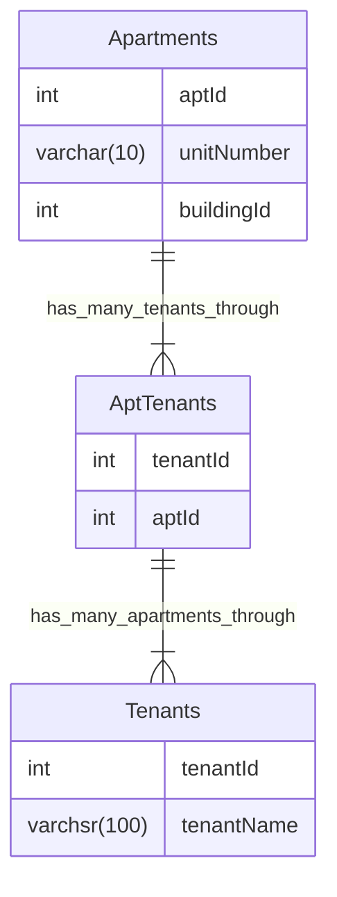

# title

## Purpose

Learning MySQL is valuable because it equips you with the essential skills to efficiently manage and manipulate relational databases, empowering you to handle data effectively in a wide range of applications and industries.

## Concept

### Init

* Install: `brew install mysql`
* Start: `brew services start mysql`
* Open console: `mysql -u root -p` and then enter password

### Database

* Create: `CREATE DATABASE desired_database_name`
* Read
  * Databases: `SHOW DATABASES;`
  * Specific database: `USE database_name;`
* Update
  * rename database
    ```mysql
    -- 1. Backup the Database
    -- 2. Run SQL Query
    RENAME DATABASE old_name TO new_name;
    ```
* Destroy: `drop database <db_name>;`

### Table

* Create: `CREATE TABLE desired_table_name ...`
  * Example:
    ```bash
    CREATE TABLE users(id INT(11) AUTO_INCREMENT PRIMARY KEY, name VARCHAR(100), email VARCHAR(100), username VARCHAR(30), password VARCHAR(100), register_date TIMESTAMP DEFAULT CURRENT_TIMESTAMP);
    ```
* Read: `SHOW TABLES;`
* Update
  * rename table: `RENAME TABLE tb1 TO tb2;`
  * transfer table: `CREATE TABLE destination_db.my_table SELECT * FROM source_db.my_table;`
* Destroy: `DROP TABLE "TABLE_NAME";`

### Row

* Create: `INSERT INTO table_name(attributes...) VALUES(values...)`
* Read
  * All rows: `SELECT * FROM table_name;`
  * Specific condition: `SELECT * FROM table_name where xxx`
  * Specific column: `SELECT xxx FROM table_name`
* Update
  ```mysql
  UPDATE table_name
  SET column1 = value1, column2 = value2, ...
  WHERE condition;
  ```
* Destroy: `DELETE FROM ‘table_name’ WHERE (condition)`

### Data type

#### Numeric

* exact
  * INTEGER (INT): An integer data type represents whole numbers without any fractional part. In most systems, it typically occupies 4 bytes of memory, allowing it to represent values within a certain range, often from -2,147,483,648 to 2,147,483,647. (-2^31 to (2^31 - 1))
  * SMALLINT: Similar to INTEGER but typically occupies less memory, often 2 bytes. It's used for smaller integer values, covering a smaller range, usually from -32,768 to 32,767. (-2^15 to (2^15 - 1))
  * DECIMAL (EDC, FIXED): This data type is used for storing exact decimal numbers. It's commonly used for financial calculations where precision is critical. DECIMAL data type stores numbers as fixed-point numbers, meaning they have a fixed number of digits after the decimal point.
  * NUMERIC: Similar to DECIMAL, NUMERIC is used for storing exact numeric values with fixed precision and scale. It's often interchangeable with DECIMAL in many database systems.
* approximate
  * FLOAT: A floating-point data type represents approximate real numbers. It's used for storing numbers with a fractional part or numbers that require a large range but don't need exact precision. FLOAT values are stored in scientific notation and can represent a wide range of values, but they may not always be precise due to the limitations of floating-point arithmetic.
  * REAL: REAL is a synonym for FLOAT in some database systems. It represents single-precision floating-point numbers, typically occupying 4 bytes of memory.
  * DOUBLE PRECISION: Also known as DOUBLE, this data type represents double-precision floating-point numbers. It offers higher precision compared to FLOAT or REAL, typically occupying 8 bytes of memory. DOUBLE PRECISION can store larger values and provide greater precision for calculations.

#### Time

* DATE: The DATE data type is used for storing dates without any time information. It typically represents a calendar date in the format YYYY-MM-DD, where YYYY represents the year, MM represents the month (01-12), and DD represents the day of the month (01-31).
* TIME: The TIME data type is used for storing time information without any date component. It represents a specific time of day in the format HH:MM:SS, where HH represents the hour (00-23), MM represents the minute (00-59), and SS represents the second (00-59).
* DATETIME: DATETIME is a combined data type that stores both date and time information. It represents a specific point in time, including both the date and time components. The format for DATETIME data varies depending on the database system but often follows the pattern YYYY-MM-DD HH:MM:SS.
* TIMESTAMP: TIMESTAMP is similar to DATETIME but typically represents a point in time relative to a specific reference point, such as the Unix epoch (January 1, 1970, UTC). It can store a larger range of values compared to DATETIME and may also have fractional seconds precision.
* YEAR: The YEAR data type is used for storing only the year component of a date. It typically represents a calendar year in a four-digit format (YYYY).

#### String

* CHAR: CHAR is a fixed-length character string data type. When you define a column as CHAR, you must specify a fixed length for the string. If the actual string is shorter than the specified length, it will be padded with spaces to match the length. CHAR is useful for storing strings of a known and consistent length.
* VARCHAR: VARCHAR is a variable-length character string data type. It allows you to store strings of varying lengths, up to a maximum specified length. Unlike CHAR, VARCHAR only uses as much storage space as necessary to store the actual string, plus a small overhead.
* BINARY: BINARY is a fixed-length binary string data type. Similar to CHAR, when you define a column as BINARY, you must specify a fixed length for the binary string. It's commonly used for storing binary data, such as images or encrypted data.
* VARBINARY: VARBINARY is a variable-length binary string data type. It allows you to store binary data of varying lengths, up to a maximum specified length. Like VARCHAR, VARBINARY only uses as much storage space as necessary for the actual data.
* BLOB (Binary Large Object): BLOB is a data type used for storing large binary objects, such as images, audio/video files, or other binary data. It can store variable-length binary data of virtually any size, making it suitable for handling large files.
* TEXT: TEXT is a data type used for storing large strings of text. It's similar to VARCHAR but optimized for storing large amounts of text data. TEXT columns can store variable-length strings with a maximum length determined by the database system.
* ENUM: ENUM is a data type that represents a set of **predefined values**. When you define a column as ENUM, you specify a list of allowed values. The column can then only store one of these predefined values, providing a way to enforce data integrity and limit the possible values for the column.
* SET: SET is similar to ENUM but allows multiple values to be selected from a predefined list. When you define a column as SET, you specify a list of allowed values, and the column can store a combination of these values.

#### Spatial

Spatial data types are specialized data types used in databases to represent geometric objects or spatial information. These data types enable the storage and manipulation of spatial data, such as points, lines, polygons, and other geometric shapes, as well as performing spatial queries and analyses.

* Point: Represents a single point in space defined by its coordinates (x, y). Points are often used to represent specific locations or objects with a precise position.
* LineString: Represents a sequence of connected straight line segments. LineStrings are commonly used to represent linear features such as roads, rivers, or paths.
* Polygon: Represents a closed geometric shape with three or more vertices connected by straight line segments. Polygons are often used to represent areas or regions, such as land parcels, buildings, or administrative boundaries.
* MultiPoint: Represents a collection of points. MultiPoints are useful for storing multiple discrete points as a single entity.
* MultiLineString: Represents a collection of LineStrings. MultiLineStrings are useful for storing complex linear features composed of multiple segments.
* MultiPolygon: Represents a collection of Polygons. MultiPolygons are useful for storing complex geographic features with multiple contiguous areas.

#### JSON

The JSON data type is a relatively new addition to many relational database management systems (RDBMS), including PostgreSQL, MySQL, and others. It allows for the storage, retrieval, and manipulation of JSON (**JavaScript** Object Notation) data directly within the database.

The JSON data type in databases provides several benefits:

* Flexible Schema: JSON allows for semi-structured data storage, meaning that each JSON document can have its own structure without requiring a predefined schema. This flexibility is useful for applications where the structure of the data may vary from one record to another.
* Efficient Storage: JSON data is stored in a compact binary format within the database, optimizing storage space compared to traditional relational data types.
* Querying and Indexing: Many modern databases that support the JSON data type also provide functionality for querying and indexing JSON data. This allows for efficient retrieval and manipulation of JSON documents using SQL-like query languages and indexing mechanisms.
* Integration with Applications: With the increasing popularity of web and mobile applications that communicate using JSON, storing JSON data directly in the database can simplify data integration and reduce the need for complex data transformation logic in the application layer.

Here's a basic example of creating a table with a JSON column in PostgreSQL:

```sql
CREATE TABLE users (
    id SERIAL PRIMARY KEY,
    name VARCHAR(50),
    data JSON
);
```

In this example, the "data" column is defined as type JSON, allowing it to store JSON documents.

You can then insert JSON data into the "data" column using standard SQL syntax:

```sql
INSERT INTO users (name, data)
VALUES ('John', '{"age": 30, "email": "john@example.com"}');
```

And you can query JSON data using SQL:

```sql
SELECT name, data->>'email' AS email
FROM users
WHERE data->>'age' > '25';
```

This query retrieves the names and email addresses of users with an age greater than 25 from the "users" table.

#### Default Value

You can explicitly specify the default value for the new created record; for example,
```mysql
CREATE TABLE t1 (
  -- literal defaults
  i INT         DEFAULT 0,
  c VARCHAR(10) DEFAULT '',
  -- expression defaults
  f FLOAT       DEFAULT (RAND() * RAND()),
  b BINARY(16)  DEFAULT (UUID_TO_BIN(UUID())),
  d DATE        DEFAULT (CURRENT_DATE + INTERVAL 1 YEAR),
  p POINT       DEFAULT (Point(0,0)),
  j JSON        DEFAULT (JSON_ARRAY())
);
```

### Syntax

#### GROUP BY & HAVING

```SQL
SELECT column1, column2, aggregate_function(column3)
FROM table_name
GROUP BY column1, column2
HAVING aggregate_function(column3) condition;
```

The concept of GROUP BY is to group the rows according to the values of the columns. After we have the GROUP BY, we can then use aggregate_function to manipulate the data of these groups; for example, sum(column3) will return sum of the value of the column3 on each group with specific value of column1 and column2.

### Bottleneck

You can use EXPLAIN to check the most time consuming steps of that command; for example,

Let's create some data

```sql
-- create
CREATE TABLE EMPLOYEE (
  empId INTEGER PRIMARY KEY,
  name TEXT NOT NULL,
  dept TEXT NOT NULL
);

-- insert
INSERT INTO EMPLOYEE VALUES (0001, 'Clark', 'Sales');
INSERT INTO EMPLOYEE VALUES (0002, 'Dave', 'Accounting');
INSERT INTO EMPLOYEE VALUES (0003, 'Ava', 'Sales');

-- fetch 
SELECT * FROM EMPLOYEE WHERE dept = 'Sales';
```

And run the following code

```sql
EXPLAIN SELECT * FROM customers WHERE country = 'USA';
```

Result

```bash
Output:

+----+-------------+----------+------------+------+---------------+------+---------+------+------+----------+-------------+
| id | select_type | table    | partitions | type | possible_keys | key  | key_len | ref  | rows | filtered | Extra       |
+----+-------------+----------+------------+------+---------------+------+---------+------+------+----------+-------------+
|  1 | SIMPLE      | EMPLOYEE | NULL       | ALL  | NULL          | NULL | NULL    | NULL |    3 |    33.33 | Using where |
+----+-------------+----------+------------+------+---------------+------+---------+------+------+----------+-------------
```

* id: An identifier for the select query within the output. If the query is a subquery, this id will be unique within the query execution plan.
* select_type: Describes the type of SELECT query being executed. In this case, it's SIMPLE, which means it's a simple SELECT statement without any subqueries or unions.
* table: The table being accessed or used in the query. In this case, it's the EMPLOYEE table.
* partitions: Information about partitions used. In this case, it's NULL, indicating that partitions are not being used.
* type: The join type being used to access the table. In this case, it's ALL, which means a full table scan is being performed. This is often not ideal for performance, especially on large tables.
* possible_keys: Lists the indexes that MySQL can potentially use to optimize the query. In this case, it's NULL, indicating that no indexes are being used.
* key: Indicates the index that MySQL actually uses to optimize the query. In this case, it's NULL, meaning no index is being used.
* key_len: The length of the index that MySQL would use if it were using an index. In this case, it's NULL because no index is being used.
* ref: Shows the columns or constants that are compared to the index named in the key column. In this case, it's NULL because no index is being used.
* rows: Estimates the number of rows MySQL must examine to execute the query. In this case, it's 3 rows.
* filtered: Represents the percentage of rows that satisfy the WHERE condition. In this case, it's 33.33%, indicating that about one-third of the rows are expected to satisfy the condition.
* Extra: Provides additional information about the query execution plan. In this case, it says "Using where", which means that the WHERE clause is being used to filter rows.

Also, use ANALYZE

```sql
EXPLAIN ANALYZE SELECT * FROM EMPLOYEE WHERE dept = 'Sales';
```

Output:

+-------------------------------------------------------------------------------------------------------------------------------------------------------------------------------------------------+
| EXPLAIN                                                                                                                                                                                         |
+-------------------------------------------------------------------------------------------------------------------------------------------------------------------------------------------------+
| -> Filter: (employee.dept = 'Sales')  (cost=0.55 rows=1) (actual time=0.020..0.024 rows=2 loops=1)
    -> Table scan on EMPLOYEE  (cost=0.55 rows=3) (actual time=0.015..0.018 rows=3 loops=1)
 |
+-------------------------------------------------------------------------------------------------------------------------------------------------------------------------------------------------+

* Filter: This part indicates that there's a filter condition being applied. Specifically, it's filtering rows where the dept column in the EMPLOYEE table is equal to 'Sales'.
* Cost: The cost estimate for this operation. Lower costs generally indicate better performance. In this case, the cost is 0.55.
* Rows: The estimated number of rows that will be processed by this operation. It estimates 1 row will be returned.
* Actual Time: The actual time taken for this operation during execution. It includes the time taken for fetching the rows. The format is (start time..end time).
* Rows: The actual number of rows processed during execution. In this case, it processed 2 rows.
* Loops: The number of iterations or loops for this operation. In this case, it's 1 loop.
* Table Scan: Indicates the type of access method used for accessing the table. In this case, it's a table scan, meaning MySQL will scan the entire table.

## Example

### Multiple Apartments



* Question: Write a SQL query to get a list of tenants who are renting more than one apartment.
* Code:
  ```MySQL
  SELECT Tenants.tenantName FROM Tenants joins AptTenants on Tenants.tenantId = AptTenants.tenantId GROUP BY Tenants.tenantId HAVING COUNT(AptTenants.aptId) > 1
  ```

### insert csv

* Create table with same column names of csv file
  ```bash
  CREATE TABLE Nikkei_225 (
    id INT NOT NULL AUTO_INCREMENT,
    Date DATE NOT NULL, 
    Open DECIMAL(19, 4),
    High DECIMAL(19, 4),
    Low DECIMAL(19, 4),
    Close DECIMAL(19, 4), 
    Adj_Close DECIMAL(19, 4),
    PRIMARY KEY (id)
  );
  ```
* Load csv data
  ```bash
  LOAD DATA INFILE '/private/tmp/C.csv'
    INTO TABLE Nikkei_225
    FIELDS TERMINATED BY ','
    ENCLOSED BY '"'
    LINES TERMINATED BY '\n'
    IGNORE 1 ROWS;
  ```
  * `FIELDS TERMINATED BY ','` means the method to separate each data in a row is by `,`
  * `ENCLOSED BY '"'` means each data is warped by `"`
  * `LINES TERMINATED BY '\n'` means the separating method between each line is \n, the regular expression representing change line
  * `IGNORE 1 ROWS` means the process during import csv file will ignore the column names whose location is on first row

## Reference

[data type](https://dev.mysql.com/doc/refman/8.0/en/data-types.html#:~:text=MySQL%20supports%20SQL%20data%20types,and%20the%20JSON%20data%20type.)
[10.8.1 Optimizing Queries with EXPLAIN](https://dev.mysql.com/doc/refman/8.3/en/using-explain.html)
