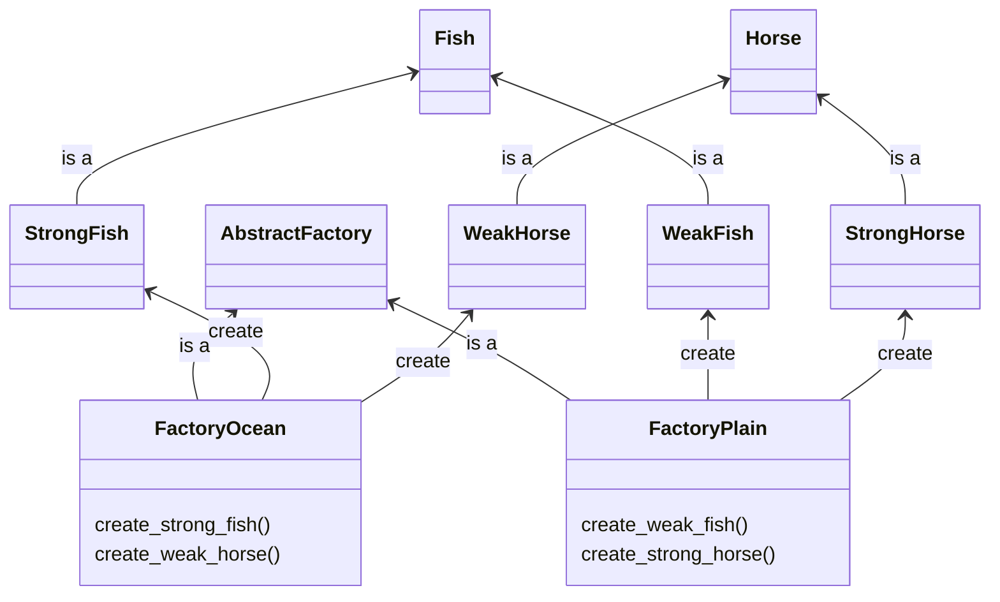

# Title

## Purpose

Abstract factory is the extension of factory method. Use the abstract factory pattern when you need to create families of related objects and ensure their compatibility, whereas the factory method pattern is suitable for creating individual objects with customization.

## Concept

Recap: We call the factory method to create **same** kind of product but choose **different** feature during the process of production.

If we want the factory to create various product, we need the factory to have various product lines, which is the abstract factory design pattern.

For example, let's say we want two environments, ocean and plain and two types of monsters, horse and fish. The horse monster is strong in plain but weak in ocean; the fish monster is strong in ocean but weak in plain. We need two factories for two environments. Each has two product lines.

so the methods to create the monsters accroding to the envrionmnets would be as follow:

```ruby
def create_monsters(FactoryOcean.new)
end

def create_monsters(FactoryPlain.new)
end
```

and the UML would be as follow:



## Example

```ruby
class AbstractFactory {
  createFish() {
    throw new Error(`${this.constructor.name} has not implemented method 'createFish'`);
  }

  createHorse() {
    throw new Error(`${this.constructor.name} has not implemented method 'createHorse'`);
  }
}

class FactoryOcean extends AbstractFactory {
  createFish() {
    return new StrongFish();
  }

  createHorse() {
    return new WeakHorse();
  }
}

class FactoryPlain extends AbstractFactory {
  createFish() {
    return new WeakFish();
  }

  createHorse() {
    return new StrongHorse();
  }
}

class Fish {
  power() {
    throw new Error(`${this.constructor.name} has not implemented method 'power'`);
  }
}

class StrongFish extends Fish {
  power() {
    return 'strong fish';
  }
}

class WeakFish extends Fish {
  power() {
    return 'weak fish';
  }
}

class Horse {
  power() {
    throw new Error(`${this.constructor.name} has not implemented method 'power'`);
  }
}

class StrongHorse extends Horse {
  power() {
    return 'strong horse';
  }
}

class WeakHorse extends Horse {
  power() {
    return 'weak horse';
  }
}

function createMonsters(factory) {
  const fish = factory.createFish();
  const horse = factory.createHorse();

  console.log(fish.power());
  console.log(horse.power());
}

createMonsters(new FactoryOcean());
createMonsters(new FactoryPlain());
```

## Reference

[Abstract Factory Pattern – Design Patterns (ep 5)](https://www.youtube.com/watch?v=v-GiuMmsXj4&list=PLrhzvIcii6GNjpARdnO4ueTUAVR9eMBpc&index=5)
