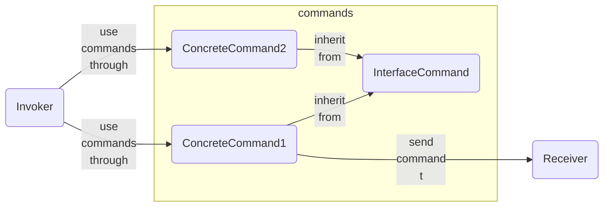
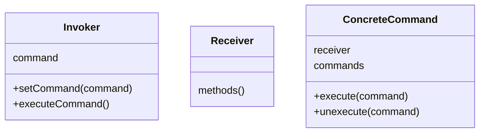

# Title

## Purpose

With command pattern, we can wrap operations into stand-alone objects in which we can

* change remote control (invoker)
* queue series commands (not every language supports metaprogramming)
  * we can also store them in database, not only RAM
* reverse commands (unexecute)

## Concept



* Invoker can be anything. We can attach the ConcreteCommand to **any button** such as a remote controller.
* ConcreteCommands in a particular invoker can request commands to **more than one receiver** or no receiver



### pros

* Single Responsibility Principle. Decouple invoking operations from performing operations
* Open/Closed Principle. Introduce new commands without breaking existing client code
* reversible commands
* can store the commands as parameters -> store them -> execute them later or on particular time
* decompose commands as meticulous as possible and reassemble them to other complex commands

### cons

* may creates too detailed and too many classes for commands

## Example

For example, a robot performs a serial movements to dance: right leg, left leg, head, butt and we can write a script as follow:

```javascript
class Robot {
  constructor() {
  }

  moveRightLeg() {
    console.log('move right leg');
  }

  moveLeftLeg() {
    console.log('move left leg');
  }

  moveHead() {
    console.log('move head');
  }

  moveButt() {
    console.log('move butt');
  }

  // ... other movements
}

const robot = new Robot();

robot.moveRightLeg();
robot.moveLeftLeg();
robot.moveHead();
robot.moveButt();
```

With command pattern, we can achieve properties:

* change remote control (invoker)
* queue series commands
* can reverse command (unexecute)

```javascript
class Robot {
  constructor() {
  }

  moveRightLeg() {
    console.log('move right leg');
  }

  moveLeftLeg() {
    console.log('move left leg');
  }

  moveHead() {
    console.log('move head');
  }

  undoRightLeg() {
    console.log('undo right leg');
  }

  undoLeftLeg() {
    console.log('undo left leg');
  }

  undoHead() {
    console.log('undo head');
  }

  // ... other movements
}

class Command {
  execute() {
    throw new Error(`${this.constructor.name} has not implemented method 'execute'`);
  }

  unexecute() {
    throw new Error(`${this.constructor.name} has not implemented method 'unexecute'`);
  }
}

class CustomCommand extends Command {
  constructor(receiver, commands) {
    super();
    this.receiver = receiver;
    this.commands = commands;
  }

  execute() {
    this.commands.forEach(command => {
      switch (command) {
        case 'move_right_leg':
          this.receiver.moveRightLeg();
          break;
        case 'move_left_leg':
          this.receiver.moveLeftLeg();
          break;
        case 'move_head':
          this.receiver.moveHead();
          break;
        // Add cases for other movements
      }
    });
  }

  unexecute() {
    this.commands.reverse().forEach(command => {
      switch (command) {
        case 'move_right_leg':
          this.receiver.undoRightLeg();
          break;
        case 'move_left_leg':
          this.receiver.undoLeftLeg();
          break;
        case 'move_head':
          this.receiver.undoHead();
          break;
        // Add cases for undoing other movements
      }
    });
  }
}

class HeadCommand extends Command {
  constructor(receiver) {
    super();
    this.receiver = receiver;
  }

  execute() {
    this.receiver.moveHead();
  }

  unexecute() {
    this.receiver.undoHead();
  }
}

class Invoker {
  constructor() {
    this.history = [];
  }

  set onPressCustomButton(commands) {
    this.onPressCustomButton = commands;
  }

  set onPressHeadButton(command) {
    this.onPressHeadButton = command;
  }

  executeCustomCommand() {
    if (this.onPressCustomButton instanceof Command) {
      this.onPressCustomButton.execute();
      this.history.push(this.onPressCustomButton);
    }
  }

  executeHeadCommand() {
    if (this.onPressHeadButton instanceof Command) {
      this.onPressHeadButton.execute();
      this.history.push(this.onPressHeadButton);
    }
  }

  undo() {
    console.log(this.history);
    const command = this.history.pop();
    if (command) {
      command.unexecute();
    }
  }
}

const invoker = new Invoker();
const receiver = new Robot();
invoker.onPressCustomButton = new CustomCommand(receiver, ['move_right_leg', 'move_left_leg']);
invoker.onPressHeadButton = new HeadCommand(receiver);

invoker.executeCustomCommand();
// results
// move right leg
// move left leg
invoker.undo();
// results
// undo left leg
// undo right leg

invoker.executeCustomCommand();
invoker.executeHeadCommand();
invoker.undo();
invoker.undo();
```

## Reference

[Command Pattern – Design Patterns (ep 7)](https://www.youtube.com/watch?v=9qA5kw8dcSU&list=PLrhzvIcii6GNjpARdnO4ueTUAVR9eMBpc&index=7)

[Command](https://refactoring.guru/design-patterns/command)
