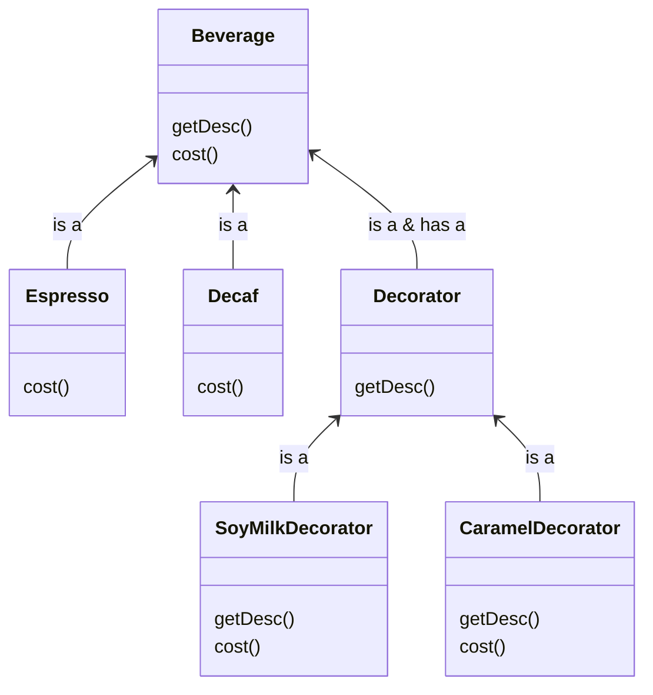

# Title

## Purpose

To change the behavior of a class without rewriting the code of the class by wrap the class with a class.

## How?

Image your restaurant serves lots of beverages and you want to design tables to store necessary information in your computer. Intuitively, there are two way: using inheritance or using polymorphism; however, inheritance creates lots of tables with duplicate methods and polymorphism creates multiple columns which is unnecessary for most other tables. To solve it, we use the concept of decorator which is to decorate the base class.

The UML:



For example, the cost of Espresso is 2 dollar and the cost of SoyMilkDecorator is 1 dollar, so I would expect that `espresso.cost = 2`, `SoyMilkDecorator.cost = 1`, `espresso_with_soymilk.cost = 3`

## Example

```javascript
class Beverage {
  get_desc() {
    throw new Error(`${this.constructor.name} has not implemented method '${this.get_desc.name}'`);
  }

  cost() {
    throw new Error(`${this.constructor.name} has not implemented method '${this.cost.name}'`);
  }
}

class Espresso extends Beverage {
  get_desc() {
    return 'Espresso';
  }

  cost() {
    return 2;
  }
}

class Decaf extends Beverage {
  get_desc() {
    return 'Decaf';
  }

  cost() {
    return 1;
  }
}

class Decorator extends Beverage {
  constructor(beverage) {
    super();
    this.beverage = beverage;
  }

  get_desc() {
    return this.beverage.get_desc();
  }
}

class SoyMilkDecorator extends Decorator {
  cost() {
    return this.beverage.cost() + 1;
  }
}

class CaramelDecorator extends Decorator {
  cost() {
    return this.beverage.cost() + 3;
  }
}

const espresso_with_soy_milk = new SoyMilkDecorator(new Espresso());
console.log(espresso_with_soy_milk.cost()); // 3
```

## Reference

[Decorator Pattern – Design Patterns (ep 3)](https://www.youtube.com/watch?v=GCraGHx6gso&list=PLrhzvIcii6GNjpARdnO4ueTUAVR9eMBpc&index=3)

[Decorator in Ruby](https://refactoring.guru/design-patterns/decorator/ruby/example)
