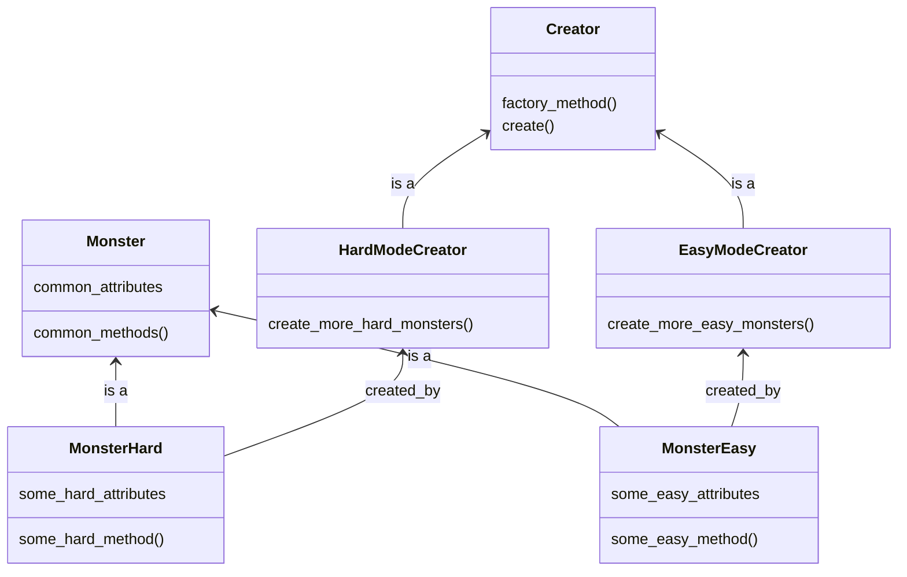

# Title

## Purpose

Factory manufactures lots of products with some common characteristics. The factory method pattern demonstrates the way to create various classes with some common characteristics, meaning we do not need lots of class to create lots of objects with some common features.

## Concept

The key concept lays on that factory determines which products to be produced on the product line, which means factory method design pattern determines which kind of object to be produced on compile time.

For example, you are creating a game and there are various maps in the world. You can use the factory method pattern to create the monsters in the world with creation logic you want. If I want the maps all fill with various monster randomly, then the UML would be as follow:



## Example

```javascript
class Creator {
  factory_method() {
    throw new Error(`${this.constructor.name} has not implemented method '${this.factory_method.name}'`);
  }

  create() {
    const product = this.factory_method();
    product.roar();
  }
}

class HardModeCreator extends Creator {
  factory_method() {
    return new MonsterHard();
  }
}

class EasyModeCreator extends Creator {
  factory_method() {
    return new MonsterEasy();
  }
}

class Monster {
  roar() {
    throw new Error(`${this.constructor.name} has not implemented method '${this.roar.name}'`);
  }
}

class MonsterHard extends Monster {
  roar() {
    console.log('hard monster come!');
  }
}

class MonsterEasy extends Monster {
  roar() {
    console.log('easy monster come!');
  }
}

function create_monster(type) {
  let factory;
  switch(type) {
    case 'hard':
      factory = new HardModeCreator();
      break;
    case 'easy':
      factory = new EasyModeCreator();
      break;
    default:
      throw new Error('Invalid monster type');
  }
  factory.create();
}

create_monster('hard');
create_monster('easy');
```

As you can see, all the monster creation use the method, `create_monster` and call different type of factory. And the Creator and Monster all inherited from interface that follows the SOLID.

## Reference

[Factory Method Pattern – Design Patterns (ep 4)](https://www.youtube.com/watch?v=EcFVTgRHJLM&list=PLrhzvIcii6GNjpARdnO4ueTUAVR9eMBpc&index=4)

[Factory Method in Ruby](https://refactoring.guru/design-patterns/factory-method/ruby/example#:~:text=Factory%20method%20is%20a%20creational,constructor%20call%20(%20new%20operator).)
