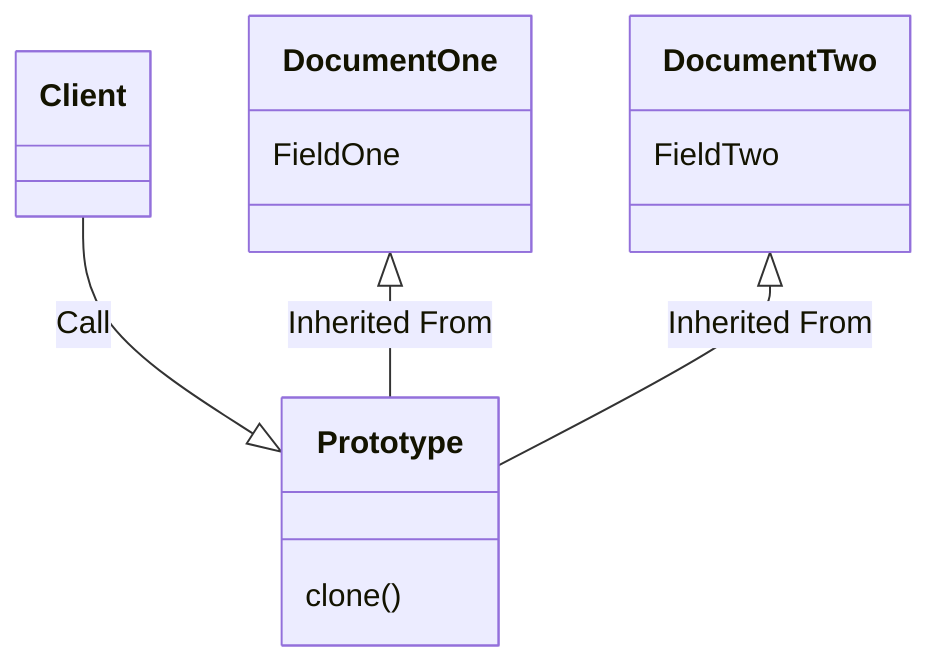

# Title

## Purpose

* Run time saving (no need to reconstructure the file)
* Avoid objects created dependent on class (we do not need to modify class to create new objects, which may affect the objects created after the midification)
* Some private field must only connected to this object cannot be used in other object

## Concept

For example, at first, there is only **one supervisor** and the host needs to print file with the title of that supervisor; however, right before the meeting, another supervisor requests to join the meeting, so we need another same file with different title. The host now may have these options:

1. copy the file and change the title of the copyed file (V)
2. change the title of the file and print it out -> increaseing the risk that the wrong title printed out in other file
3. rewrite the whole file -> takes too much time and some informations from private third-party departments may not be available while rewriting

* some confidential informations may need the customized styles to emphasize only used in this particular file for particular meetings

Prototype design pattern serves as the same concepts of the copy process (option 1); for **creating** new object by **clone** other object and do required modifications **at run time**.

### the concept of copy

Given the documents looks like

```ruby
{
  :title => 'supervisor_1',
  :article => ['article_1', 'article_2'],
  :confidential => ['confidential_1', 'confidential_2']
}
```

While programming, we may just declare another variable and change the title as follow

```ruby
x1 = {
  :title => 'supervisor_1',
  :article => ['article_1', 'article_2'],
  :confidential => ['confidential_1', 'confidential_2']
}

x2 = x1
x2[:title] = 'supervisor_2'
puts x1 # the title changed
```

The title changed because both x2 and x1 points to the same object. We need the concept of copy to help us

* shallow copy (only copy the first layer and the objects of second layer still points to the same objects from the copyed object)
* deep copy (copy whole objects including the nested objects)

In ruby, `dup` or `clone` are both shallow copy

```ruby
x1 = {
  :title => 'supervisor_1',
  :article => ['article_1', 'article_2'],
  :confidential => ['confidential_1', 'confidential_2']
}

x2 = x1.clone
x2[:title] = 'supervisor_2'
puts x1 # the title unchanged
puts x2
```

If we change the nested value as follow:

```ruby
x1 = {
  :title => 'supervisor_1',
  :article => ['article_1', 'article_2'],
  :confidential => ['confidential_1', 'confidential_2']
}

x2 = x1.clone
x2[:article][0] = 'hahahaha'
puts x1 # the article of x1 also changed
puts x2
```

To avoid it, we use `deep_dup` in ActiveSupport from rails

```ruby
x1 = {
  :title => 'supervisor_1',
  :article => ['article_1', 'article_2'],
  :confidential => ['confidential_1', 'confidential_2']
}

x2 = x1.deep_dup
x2[:article][0] = 'hahahaha'
puts x1 # the article of x1 not changed
puts x2
```

### design graph and pseudocode

The code in section, Demonstration, is for one document. We can extend this design for more documents as following design graph and pseudocode

#### design graph



#### pseudocode

```ruby
class Prototype
  def clone
  end
end

class ConfidentialReference
  ...
end

class DocumentOne < Prototype
  def initialize
    @document = 'One'
    super
  end
  ...
end

class DocumentTwo < Prototype
  def initialize
    @document = 'Two'
    super
  end
end
```

### Example

If we build the class intuitively, we may just create a class as follow:

```ruby
class Prototype
  attr_accessor :title, :articles, :confidentials

  def initialize
    @title = nil
    @articles = nil
    @confidentials = nil
  end

  def clone
    @articles = deep_copy(@articles)
    @confidentials = deep_copy(@confidentials)
    @confidentials.prototype = self
    deep_copy(self)
  end

  private
  def deep_copy(object)
    Marshal.load(Marshal.dump(object))
  end
end

class ConfidentialReference
  attr_accessor :prototype

  def initialize(prototype)
    @prototype = prototype
  end
end

# The client code.
p1 = Prototype.new
p1.title = 'supervisor_1'
p1.articles = ['article_1']
p1.confidentials = ConfidentialReference.new(p1)

p2 = p1.clone
p2.title = 'supervisor_2'

# ============
# check
p1.title != p2.title # for two different supervisor
p1.articles.equal?(p2.articles) # two different articles with same content
p1.confidentials.equal?(p2.confidentials)
p1.confidentials.prototype.equal?(p2.confidentials.prototype) # again two different confidential articles with same content, so if the information leaks, we know who did it.
```

## Reference

[Prototype Design Pattern Tutorial](https://www.youtube.com/watch?v=AFbZhRL0Uz8)

[[Design Pattern] Prototype 原型模式](https://ithelp.ithome.com.tw/articles/10221129)

[Prototype](https://refactoring.guru/design-patterns/prototype)

[Python Shallow Copy and Deep Copy](https://www.programiz.com/python-programming/shallow-deep-copy)
