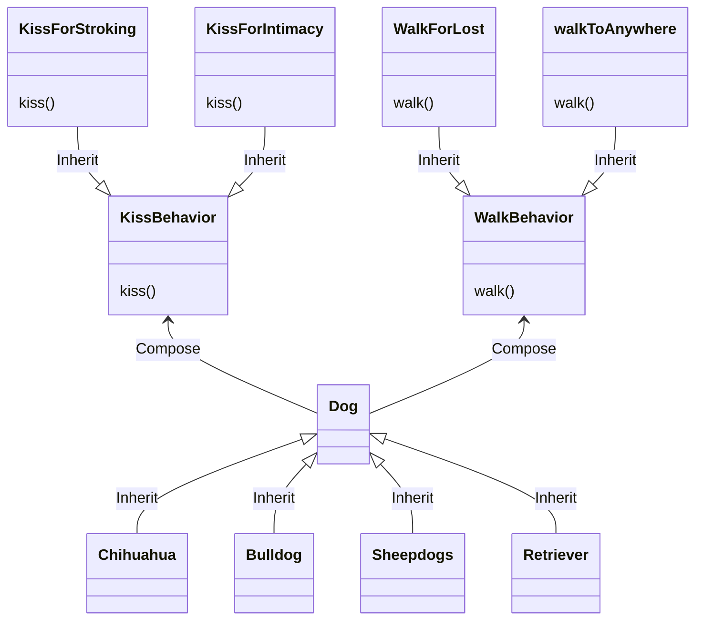

# Title

## Purpose

We do not want to rewrite the same methods in different lower classes.

## Concept

Constructs multiple intefaces for variant methods in a upper class so that we can have multiple **combinations** to create multiple classes inherit from this upper class with shared methods.

For example, given lots of varieties of dogs, there are four dogs with different **behaviors** according to their characteristics:

1. stupid dog: walks for losing its way
2. smart dog: walks to anywhere it want
3. anxious dog: kiss their owner for stroking to feel relieved
4. calm dog: kiss their owner to express intimacy

Given the characteristics above we may have four type of dogs:

1. stupid and anxious dog: Chihuahua
2. stupid and calm dog: Bulldog
3. smart and anxious dog: Sheepdogs
4. smart and calm dog: Retriever

Given the OOP concepts, we have choices as follow:

1. create an upper class and then create four classes inherit from it
2. create an polymorhpic class with four type

Given the four characteristics map four behaviors, we need to write logics or overwrite the methods in the upper class. What if we want Chihuahua to share their kissing behavior with Sheepdogs? We need the concept of **strategy** and the UML as follow:



## What?

```javascript
class Dog {
  constructor(walkBehavior, kissBehavior) {
    this.walkBehavior = walkBehavior;
    this.kissBehavior = kissBehavior;
  }

  kiss() {
    console.log(this.kissBehavior.kiss());
  }

  walk() {
    console.log(this.walkBehavior.walk());
  }
}

class KissBehavior {
  kiss() {
    throw new Error('Must');
  }
}

class WalkBehavior {
  walk() {
    throw new Error('Must');
  }
}

class KissForStroking extends KissBehavior {
  kiss() {
    return "kiss for stroking";
  }
}

class KissForIntimacy extends KissBehavior {
  kiss() {
    return "kiss for intimacy";
  }
}

class WalkForLost extends WalkBehavior {
  walk() {
    return "walk for lost";
  }
}

class WalkToAnyWhere extends WalkBehavior {
  walk() {
    return "walk to anywhere";
  }
}
```

and create instance from these four classes

```ruby
chihuahua = Dog.new(WalkForLost.new, KissForStroking.new)
chihuahua.walk
chihuahua.kiss
```

## Reference

[Strategy Pattern – Design Patterns (ep 1)](https://www.youtube.com/watch?v=v9ejT8FO-7I&list=PLrhzvIcii6GNjpARdnO4ueTUAVR9eMBpc)
