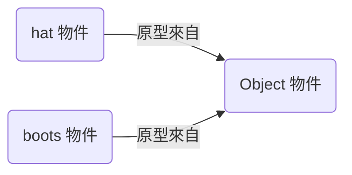
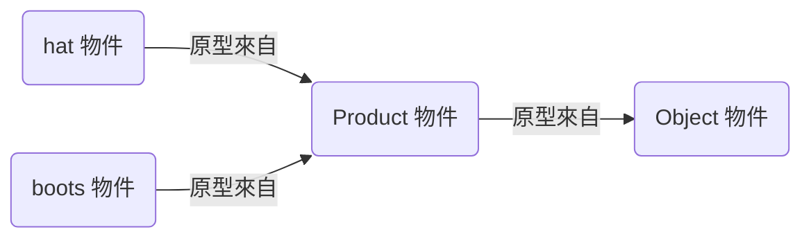
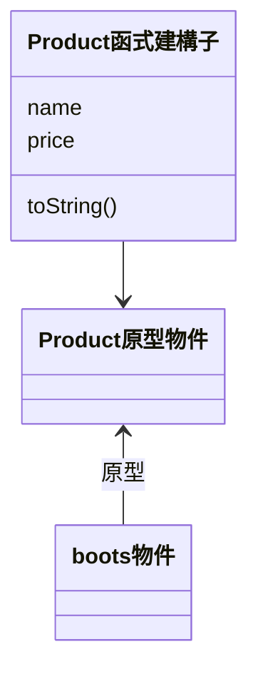
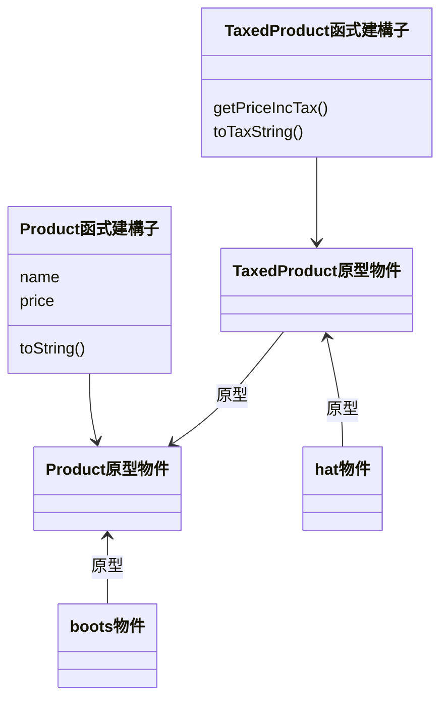

# Title

本章將繼續介紹 javascript 的基本概念

## topics

### Prototype (原型)

我們先不考慮 ES6 後引進的 class，在原始的設計中，javascript 沒有 class。所有 javascript 中的物件都會連結到一個原型物件，所以如果我們呼叫一個目前物件沒有的方法，那他會直接呼叫上游的方法，舉例來說：

```javascript
// Parent object
var parent = {
  greet: function() {
    console.log("Hello from the parent!");
  }
};

var child = Object.create(parent);

child.greet(); // Output: "Hello from the parent!"
```

且

```javascript
child.toString() // [object Object]
```

因為 parent 沒有定義 toString() 方法，所以他將會去找最上游的 Object 中的 toString() 方法，並返回 [object Object]。[object Object] 只是一個 default 值，沒有什麼意義。

#### 檢視原型 (inspect)



首先我們先定義兩個 object，我們可以透過 getPrototypeOf() 檢視原型物件

```javascript
let hat = {
  name: "Hat",
  price: 100
};

let boots = {
  name: "Boots",
  price: 100
};

let hatPrototype = Object.getPrototypeOf(hat) // 得到 hat 的原型，也就是 Object，而他也是 boots 的原型
let bootsPrototype = Object.getPrototypeOf(boots)

console.log(hatPrototype === bootsPrototype) // true，因為兩者的原型都是 Object
```

#### 修改原型 (amend)


依照上一章節，我們知道 hat 與 boots 的原型是同一個，所以我們更改 hat 的原型方法，也就對應的會更改到 boots 的原型方法，例如：

```javascript
let hat = {
  name: "Hat",
  price: 100
};

let boots = {
  name: "Boots",
  price: 100
};

let hatPrototype = Object.getPrototypeOf(hat)
hatPrototype.toString = function() { // 也會更改到 boots 的 toString()
  return `toString: Name: ${this.name}, Price: ${this.price}`
}

console.log(boots.toString()) // toString: Name: Boots, price: 100
```

#### 自訂原型 (define)



上一個 section 是直接更改 Object 的方法，但這樣很危險，比較好的作法是先定義一個原型供 hat 與 boots 使用，例如：

```javascript
let Product = {
  toString: function() {
    return `toString: Name: ${this.name}, Price: ${this.price}`
  }
}

let hat = {
  name: "Hat",
  price: 100
};

let boots = {
  name: "Boots",
  price: 100
};

// 將物件的原型設定為 Product
Object.setPrototypeOf(hat, Product)
Object.setPrototypeOf(boots, Product)

// 此時 toString() 將會 call Product 中的，而非 Object 中的，且更改 toString()，也僅會更改 Product 中的 toString()
```

#### 使用 function 建構 object



上面的 hat 與 boots 可以統一透過創造一個 function 來建構他們

```javascript
let Product = function(name, price) {
  this.name = name
  this.price = price
  this.toString = function() {
    return `toString: Name: ${this.name}, Price: ${this.price}`
  }
}

let hat = new Product("Hat", 100)
let boots = new Product("Boots", 100)

Object.getPrototypeOf(hat) === Object.getPrototypeOf(boots) // true，兩者的原型都是 Product。
```

此 function 會建構 Product 原型且其中包含 name 與 price，再透過 new 建立新物件。

#### 建立 function constructor 的 prototype

在前面的 section 我們看到如何透過 setPrototypeOf 架構原型，又看到 function construct 物件時會有一個原型產生，這裡我們要將兩個 function constructors 產生的兩個原型建立關係。



關鍵在我們將透過 Object.setPrototypeOf(TaxedProduct.prototype, Product.prototype) 建立

```javascript
let Product = function(name, price) {
  this.name = name
  this.price = price
  this.toString = function() {
    return `toString: Name: ${this.name}, Price: ${this.price}`
  }
}

let TaxedProduct = function(name, price, taxRate) {
  Product.call(this, name, price) // Then we have this.name, this.price, this.toString() from Product
  this.taxRate = taxRate
  this.getPriceIncTax = function() {
    return Number(this.price) * this.taxRate
  }
  this.toTaxString = function() {
    return `${this.toString()}, Tax: ${this.getPriceIncTax()}`
  }
}

Object.setPrototypeOf(TaxedProduct.prototype, Product.prototype)

let hat = new TaxedProduct("Hat", 100, 1.2)
console.log(hat.toTaxString())
console.log(hat.toString()) // It will call the method defined in Product
```

#### 物件是否為某一物件的原型 (check prototype)

我們沿用上一 section 的 Product 與 TaxProduct，建立 hat 與 boots

```javascript
let hat = new TaxedProduct("Hat", 100, 1.2)
let boots = new Product("Boots", 100)

hat instanceof TaxedProduct // true
hat instanceof Product // true
boots instanceof TaxedProduct // false
boots instanceof Product // true
```

#### 自定義靜態屬性與方法 (static method)

前面有用到 setPrototypeOf，就是 Object 這個原型的靜態方法。我們也可以自行定義在 function constructor 中，我們使用前面定義的 Product function，並在 function 中建立一個 process() 方法

```javascript
Product.process = (...products) => {
  products.forEach((p) => {console.log(p.toString())})
}

// Usage
Product.process(
  new Product("Hat", 100, 1.2)
  new Product("Boots", 100)
)

// toString: Name: Hat, Price: 100
// toString: Name: Boots, Price: 100
```

### Class (類別)

在 ES6 後我們有了 class，可以在 javascript 中使用，範例如下

```javascript
class Product {
  constructor(name, price) {
    this.name = name
    this.price = price
  }

  toString() {
    return `toString: Name: ${this.name}, Price: ${this.price}`
  }
}

let hat = new Product("Hat", 100)
console.log(hat.toString())
```

然後我們可以用 extend 來實踐 class 中的繼承

```javascript
class TaxedProduct extends Product {
  constructor(name, price, taxRate = 1.2) {
    super(name, price)
    this.taxRate = taxRate
  }

  getPriceIncTax() {
    return Number(this.price) * this.taxRate
  }

  toString() {
    let chainResult = super.toString()
    return `${chainResult}, Tax: ${this.getPriceIncTax()}`
  }
}
```

#### 定義靜態方法 (define static)

這個靜態方法其實類似 class method，就是僅能透過 class 呼叫，例如

```javascript
class TaxedProduct extends Product {
  ...
  static process(...products) {
    products.forEach((p) => {
      console.log(p.toString())
    })
  }
}

// Usage
TaxedProduct.process(hat, boots) // can only use TaxedProduct to call process
```

### iterator & generator

假設我們有一個 array，我們想要一個一個打印出來。

#### 迭代器（iterator）

```javascript
const colors = ['紅色', '綠色', '藍色'];

const colorsIterator = {
  index: 0,
  next: function() { // 我們可以自行定義 next() 邏輯
    if (this.index < colors.length) {
      return { value: colors[this.index++], done: false };
    } else {
      return { value: undefined, done: true };
    }
  }
};

console.log(colorsIterator.next().value); // 輸出：紅色
console.log(colorsIterator.next().value); // 輸出：綠色
console.log(colorsIterator.next().value); // 輸出：藍色
console.log(colorsIterator.next().value); // 輸出：undefined，表示已經遍歷完所有元素
```

#### 生成器（generator）

```javascript
// 定義一個生成器函數
function* generateColors() {
  yield '紅色';
  yield '綠色';
  yield '藍色';
}

// 創建一個生成器對象
const colorsGenerator = generateColors();

// 使用生成器遍歷元素
console.log(colorsGenerator.next().value); // 輸出：紅色
console.log(colorsGenerator.next().value); // 輸出：綠色
console.log(colorsGenerator.next().value); // 輸出：藍色
console.log(colorsGenerator.next().value); // 輸出：undefined，表示已經遍歷完所有元素
```

### 集合 (Collection)

Object 的結構本身也類似 HashMap，假設我們想建立一個 data Object 且當中包含兩個 product

```javascript
let data = {
  hat: new Product("Hat", 100)
}

data["boots"] = new Product("Boots", 100)
```

我們可以透過 Object.keys 獲得該 object 的 keys 且透過 Object.values 獲得 object 的 values。也可以進一步進行 loop

```javascript
Object.keys(data).forEach(key => console.log(data[key].toString()))
```

#### Map

Object 僅能使用 string 作為 key，而 Map() 可以用其他的

```javascript
let data = new Map()
data.set(1, new Product("Hat", 100))
data.set(2, new Product("Boots", 100))
```

而 javascript 中的 Symbol() 可以創造獨一無二值，所以我們可以使用它來建立 Map 的 key，保證一定不會起衝突，例如複寫某一 key 的 value

```javascript
class Product {
  constructor(name, price, supplier) {
    this.id = Symbol()
    this.name = name
    this.price = price
    this.supplier = supplier
  }
}

let products = new Map()
[new Product("Hat", 75, "A"), new Product("Hat", 100, "B")].forEach((p) => {
  products.set(p.id, p)
})

console.log(products)
```

#### Set

Javascript 也有 Set，不存放重複的值。

```javascript
let product = new Product("Hat", 100)
for (let i = 0; i < 5; i++) {
  productSet.add(product)
}

console.log(`Set size: ${productSet.size}`)
```

### module

過去 CommonJS 是使用 require() 與 module.exports，在 ES6 後，我們可以透過設定使用 ECMAScript Modules 的 export default 與 import。設定方法就是加入 "type": "module" 在 package.json 中。

```JSON
{
  ...
  "type": "module"
}
```

然後我們就可以在 index.js 中透過 import 導入 tax.js 如下：

```javascript
// tax.js
export default function(price) { // 無需給此 function 取名，因為 default 告知 JS 此檔案預設要 export 此 function
  return Number(price) * 1.2
}
```

且

```javascript
// index.js
import calcTax from './tax.js' // -> import 來自 tax.js 的 function，可取任意名字。
...
let taxedPrice = calcTax(...)
```

上面例子透過 default 來 export function，我們也可以為該 function 取名，則 import 將需特定告知要 import 的 function 的名字：

```javascript
// tax.js
export function calculateTax(price) { // specify the function name
  return Number(price) * 1.2
}
```

然後

```javascript
// index.js
import { calculateTax } from "./tax.js"
...
let taxedPrice = calculateTax(product.price)
```

更棒的是兩個概念可以共用，我們可以同時有命名好的 function 與 default 的 function

```javascript
export function calculateTax(price) {
  return Number(price) * 1.2
}

export default function(...prices) {
  return prices.reduce((total, p) => {total += calculateTax(p), 0})
}
```

然後

```javascript
import calcTaxAndSum, { calculateTax } from "./tax.js" // calcTaxAndSum 導入 default function 而 calculateTax 導入命名好的 function
```

如果有多個命名好的 function，則如下

```javascript
// ./utils.js
export function printDetails(product) {
  ...
}

export function applyDiscount(product) {
  ...
}
```

然後 import

```javascript
// index.js
import { printDetails, applyDiscount } from "./utils.js"
```

## Reference

TypeScript 邁向專家之路

[Iterators and generators](https://developer.mozilla.org/en-US/docs/Web/JavaScript/Guide/Iterators_and_Generators)
