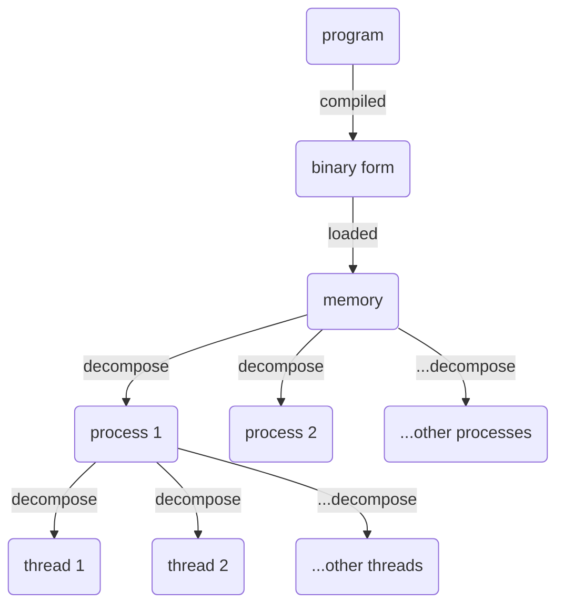
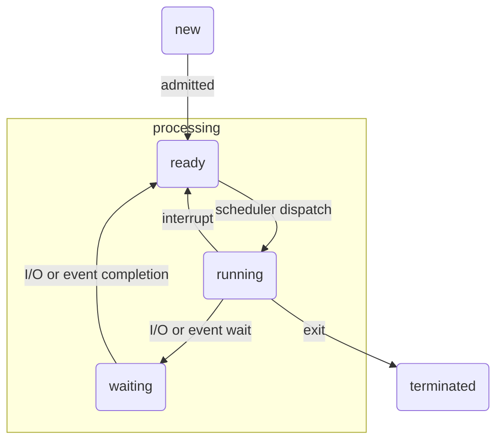

# Title

## Purpose

Understanding operating systems and properly managing processes allows for efficient code, improved system stability, concurrent system development, and effective issue identification and debugging.

## Concept



### Flow of process

#### Creation

* Goal: To solve the program we required computer do
* Steps: 
  * Allocating resources: OS sets up address space, allocates memory, and creates a page table.
  * Initializing data structures: Process control block (PCB) is initialized with process details.
  * Setting up the environment: OS prepares initial program counter, stack pointer, and registers.

#### Scheduling
  
* Goal: Optimize CPU utilization, minimize response time, ensure fairness in resource allocation.
* Steps:
  * Determines process execution order on the CPU.
  * Scheduler selects processes from the ready queue based on a scheduling algorithm.

#### Synchronization

* Goal: Avoids race conditions, deadlocks, and data inconsistencies on shared resource access and task cooperation.
* Steps: Uses synchronization mechanisms (locks, semaphores, mutexes) to prevent conflicts.

#### Termination

* Goal: Release resources (memory, files, system resources) when a process finishes execution or is forcibly terminated.
* Concept: Process control block is updated and associated data structures are de-allocated.

### Process Control Block (PCB)

The PCB serves a pivotal role in managing tasks like task creation, scheduling, and termination within an operating system, while its data structure holds essential process information such as state, priority, and registers. By preserving process state through context switching, the PCB facilitates multitasking and concurrent execution, underlining its significance in modern OS process management. The PCB is initiated upon process creation, containing and updating vital information like process ID, memory allocation, and CPU usage as the process runs, enabling effective process tracking and CPU scheduling.



### Thread

Threads, like processes, also have a lifecycle. Here's a general overview:

* Thread Creation: A thread is created by a process. The operating system allocates necessary resources for the thread, such as a stack, registers, and scheduling information.
* Thread Scheduling: Similar to processes, threads are scheduled by the operating system's scheduler. The scheduler determines which threads should run and when, based on factors like priority and state.
* Thread Synchronization: Threads within the same process share resources, so synchronization is crucial to prevent conflicts. Mechanisms like locks, semaphores, and condition variables can be used to ensure that threads properly coordinate when accessing shared resources or performing tasks that need to be done in a certain order.
* Thread Termination: A thread can be terminated when its task is complete, when the entire process is terminated, or when explicitly killed. Upon termination, the operating system reclaims the resources that were allocated to the thread.

Threads within the same process share the process's resources, but each thread has its own program counter, stack, and set of registers. This allows each thread to function independently while still having access to the same memory and resources as the other threads in the process.

### States of Process

The state of a process is typically determined by the state of its primary or main thread, which is the thread that begins at the program's main function.

If a process has multiple threads and one of them is in the "running" state, the process itself is generally considered to be in the "running" state, even if the other threads are in different states. This is because the process's state reflects whether it is making progress, which it can do as long as at least one of its threads is running.

### Process vs Thread

* Threads share the same resources of the process they belongs to, such as memory and files in the same process; processes take their own part of memory and cannot share memory with other process.
* Communication between threads is faster than processes.
* Threads are scheduled by the operating system, but they are not self-contained like processes.

### Issues

Here I put more efforts on deadlock, synchronization, and race

#### Deadlock

A deadlock occurs when two or more processes are blocked waiting for each other to release a resource. Deadlocks can lead to a system freeze, where no progress is made, and the processes become unresponsive

##### Solutions (order with frequency)

* Mutual Exclusion
  * Description: Two resources, A and B, and two processes, P1 and P2, that need access to both resources in order to complete their tasks. However, if both processes acquire one resource and then try to acquire the other, they may end up deadlocked, where neither process can proceed because they are both waiting for the other to release the resource it is holding.
  * Solution: Give each resource a lock. That is, processes P1 or P2 must gain the lock of each resource, then they can start to process, which means P1 and P2 are mutual exclusive
* Deadlock detection and recovery algorithms: These are widely used in many operating systems and databases to detect and recover from deadlocks.
* Resource allocation policies: These policies are commonly used to allocate resources in a way that minimizes the risk of deadlocks. For example, some systems use priority-based scheduling to give higher priority to processes that are less likely to cause deadlocks.
* Message passing: This technique is often used in distributed systems to ensure that processes can communicate with each other without the risk of deadlocks.
* Lock-free programming: This technique is gaining popularity in highly concurrent systems because it avoids the need for locks and can improve performance.
* Transactional memory: This is a relatively new technique that is gaining popularity in highly concurrent systems because it allows for fine-grained locking and can improve performance.
* Hold and Wait: This strategy can be effective in some situations, but it can also be prone to deadlocks if not used carefully.
* No Preemption: This strategy can prevent deadlocks, but it can also lead to resource starvation in certain situations.
* Circular Wait: This strategy can be effective, but it requires careful resource allocation and ordering to prevent deadlocks.

#### Synchronization for Consistency

Processes may need to synchronize their activities to ensure correct and consistent behavior. Synchronization problems can arise when processes access shared resources, communicate with each other, or perform parallel computations.

##### Solution
  
* Locks: lock all the other process when this process is processing.
* Semaphores: A way to mark a resource and make sure only pre-defined number of processes can use this resource.
  ```javascript
  class Semaphore {
    constructor(initialCount) {
      this.count = initialCount;
      this.queue = [];
    }
  
    async acquire() {
      if (this.count > 0) {
        this.count--;
      } else {
        await new Promise(resolve => this.queue.push(resolve));
      }
    }
  
    release() {
      this.count++;
      if (this.queue.length > 0) {
        const resolve = this.queue.shift();
        resolve();
      }
    }
  }
  
  const semaphore = new Semaphore(2); // Allow one process at a time
  
  async function sharedResourceAccess(id) {
    console.log(`Process ${id} is waiting for access.`);
    await semaphore.acquire();
    console.log(`Process ${id} has acquired access to the shared resource.`);
    // Simulating some work being done with the shared resource
    await new Promise(resolve => setTimeout(resolve, 2000));
    console.log(`Process ${id} is releasing the shared resource.`);
    semaphore.release(); // This step will increase the count and 
  }
  
  // Create multiple processes trying to access the shared resource
  async function runProcesses() {
    for (let i = 1; i <= 5; i++) {
      sharedResourceAccess(i);
    }
  }
  
  runProcesses();
  ```
  * When I call `runProcesses`, because of `async`, it called 5 `sharedResourceAccess` at the same time without waiting each other. In `sharedResourceAccess`, there is `await` statement of `semaphore.acquire()`, meaning it will wait until `acquire` finish.
  * `acquire` will check the number of processes we pre-defined to use the resource and if this resource is not available, it will wait `resolve` to be pushed into the queue.
  * After the work done in `sharedResourceAccess`, it will do `release()` and the `resolve()` will be called, making `Promise` to receive the `resolve` and then the `acquire` passed.
  * Then now we do not need to wait any `acquire` and the `count` is > 0, so we can do other tasks in other `sharedResourceAccess`.
* Barriers

##### Mutex vs Semaphore

They have different purpose. Mutexes are used to provide exclusive access to a shared resource to **only one thread** at a time, ensuring that multiple threads do not concurrently modify the same resource. Semaphores can be used to control access to a set of resources, allowing a **certain number** of threads to access them simultaneously while restricting others.

#### Race Conditions

* Description: A race condition occurs when two or more processes access a shared resource concurrently, and the outcome depends on the order of execution
* Solution: To prevent race conditions, you can use synchronization techniques like locks, semaphores, and barriers. You can also use atomic operations and message passing to ensure that shared resources are accessed safely and consistently.

#### Resource Allocation

* Description: Resource starvation or overloading caused by failing to manage resource efficiently for different processes, which require different amounts of CPU, memory, disk space, network bandwidth, and other resources.
* Solution: To manage resources effectively, you can use tools like task queues, load balancers, and resource allocation algorithms; for example, when a task is received, it is initially directed to available machines through load balancers. Subsequently, the task is enqueued on the designated machine using task queues, followed by the application of a resource allocation algorithm to efficiently assign the necessary resources for its execution on that machine.
  * Task queues: Task queues are systems that manage and execute tasks asynchronously, enabling efficient handling of operations like calculations, network requests, or file processing. They use queues to organize tasks, allowing producers to add tasks and consumers to retrieve and process them, offering advantages like concurrency, scalability, and asynchronous processing.
  * Load balancers: Load balancers are networking devices or software systems that distribute incoming network traffic, such as requests to a web server, across multiple servers or resources. This distribution optimizes resource utilization, enhances reliability, and ensures efficient handling of user requests, contributing to improved performance and availability of services.
  * Resource allocation algorithm: Resource allocation algorithms are techniques used by operating systems and other systems to efficiently distribute and manage available resources, such as CPU time, memory, disk space, and network bandwidth, among competing processes or tasks. These algorithms help ensure that resources are utilized optimally to achieve desired performance, fairness, and responsiveness in a multi-tasking environment.

#### Priority Inversion

* Description: Priority inversion is a situation where a low-priority process holds a resource that a high-priority process needs, leading to a delay in the high-priority process's execution. This problem is particularly prevalent in real-time systems.
* Solution: To prevent priority inversion, you can use techniques like priority inheritance, priority ceiling, and preemptive scheduling. These techniques ensure that high-priority processes get access to the resources they need without being delayed by low-priority processes.

#### Fault Tolerance

* Process management may need to handle faults and failures gracefully to maintain system availability and reliability. Fault tolerance mechanisms include process restarts, redundancy, and error detection and recovery.

#### Security

* Process management needs to enforce access control and protect against unauthorized access, malicious attacks, and other security threats.

## Reference

[Process control block](https://en.wikipedia.org/wiki/Process_control_block)

[Operating System: Process and Process Management](https://medium.com/@akhandmishra/operating-system-process-and-process-management-108d83e8ce60)

[Process Management in OS: PCB in Operating System](https://www.guru99.com/process-management-pcb.html)

[Process Control Block](https://www.youtube.com/watch?v=4s2MKuVYKV8)
